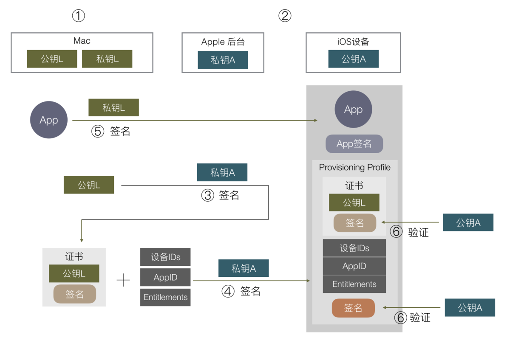

# iOS 面试 - 基本概念

- [简要叙述 OC 语言的特点](# 简要叙述 OC 语言的特点)
- [类别的作用？继承、类别和扩展在实现中有何区别](# 类别的作用？继承、类别和扩展在实现中有何区别)
- [在 OC 中类变量的 @protected,@private,@public,@package 区别](# 在 OC 中类变量的 @protected,@private,@public,@package 区别)
- [\#import、#include、@class、#import<>和 #import""的区别](#\#import、#include、@class、#import<>和 #import"" 的区别)
- [@property 的本质是什么？ivar、getter、setter 是如何生成并添加到这个类中的](#@property 的本质是什么？ivar、getter、setter 是如何生成并添加到这个类中的)
- [@property 常用属性及如何使用](#@property 常用属性及如何使用)
- [用 @property 声明的 NSString / NSArray / NSDictionary 经常使用 copy 关键字，为什么？如果改用 strong 关键字，可能造成什么问题？](# 用 @property 声明的 NSString / NSArray / NSDictionary 经常使用 copy 关键字，为什么？如果改用 strong 关键字，可能造成什么问题？)
- [为什么 IBOutlet 属性是 weak 的？](# 为什么 IBOutlet 属性是 weak 的？)
- [\__weak，\__block 的区别](#__weak，__block 的区别)
- [id 声明的对象有什么特性？](#id 声明的对象有什么特性？)
- [id 和 nil 代表什么（nil 和 NULL 的区别）](#id 和 nil 代表什么（nil 和 NULL 的区别）)
- [BOOL/bool/Boolean 的区别](#BOOL/bool/Boolean 的区别)
- [OC 的反射机制](#OC 的反射机制)
- [简述一下自动释放池底层怎么实现？](# 简述一下自动释放池底层怎么实现？)
- [堆和栈的区别？和队列](# 堆和栈的区别？和队列)
- [沙盒机制的理解和使用](# 沙盒机制的理解和使用)
- [事件响应者链的概念](# 事件响应者链的概念)
- [@synthesize 和 @dynamic 分别有什么作用？](#@synthesize 和 @dynamic 分别有什么作用？)
- [类方法和实例方法有什么区别？](# 类方法和实例方法有什么区别？)
- [浅拷贝和深拷贝的区别？](# 浅拷贝和深拷贝的区别？)
- [NSCache NSDictionary 区别](#NSCache NSDictionary 区别)
- [什么是 KVC 和 KVO？](# 什么是 KVC 和 KVO？)
- [开发中，保存数据有哪几种方式？](# 开发中，保存数据有哪几种方式？)
- [关键字 const/static/extern、UIKIT_EXTERN 区别和用法以及与宏的区别](# 关键字 const/static/extern、UIKIT_EXTERN 区别和用法以及与宏的区别)
- [关键字组合 static inline](# 关键字组合 static inline)
- [isMemberOfClass 、isKindOfClass 和 isSubclassOfClass 联系与区别](# isMemberOfClass 、isKindOfClass 和 isSubclassOfClass 联系与区别)
- [将一个函数在主线程执行的几种方法](# 将一个函数在主线程执行的几种方法)
- [+initialize 与 +load 有什么用处，区别](# +initialize 与 +load 有什么用处，区别)
- [isEqual,isEqualToString 和 == 区别](# isEqual,isEqualToString 和 == 区别)
- [分类的理解](# 分类的理解)
- [iOS 签名机制](# iOS 签名机制)

#### 简要叙述 OC 语言的特点

是根据 C 语言所衍生出来的语言，继承了 C 语言的特性，是扩充 C 的面向对象编程语言,
所以具有面向对象的语言特性，如：封装、多态、继承。
- 封装：是对象和类概念的主要特性。它是隐藏内部实现，提供外部接口。
- 继承：它可以使用现有类的所有功能，并在无需重新编写原来的类的情况下对这些功能进行扩展。
- 多态：不同对象以自己的方式响应相同的消息的能力叫做多态。
总的来说面向对象是一种思想, 目的可以让代码重用, 接口重用, 避免重复代码, 逻辑更加清晰,
更容易维护, 提高编程效率.

另外 OC 具有动态特性: 之所以叫做动态，是因为必须到运行时（runtime）才会做一些事情。
（动态特性的三个方面：动态类型、动态绑定、动态加载）  
（1）动态类型:
    动态类型，（id 类型）在编译器编译的时候不能被识别出，在运行时（runtime），程序运行的时候才会根据语境来识别。  
    静态类型，与动态类型相对。在编译的时候就能识别出来，明确的基本类型都属于静态类型。
    （int、NSString 等）  
（2）动态绑定：
    （关键词 @selector）跳过编译，在运行时动态添加函数调用，
      运行时才决定调用什么方法，传递什么参数。  
（3）动态加载：
    根据需求动态地加载资源。

#### 类别的作用？继承、类别和扩展在实现中有何区别
```
类别的作用:(1)将类的实现分散到多个不同文件或多个不同框架中。
(2)创建对私有方法的前向引用。
(3)向对象添加非正式协议。
扩展:
只有头文件没有实现文件。只能扩展方法，不能添加成员变量。扩展的方法只能在原类中实现
类扩展只能针对自定义的类，不能给系统类增加类扩展；
由于局限性比较多, 个人在开发中没有用过.
继承主要作用：
1. 重写父类方法
2. 在父类基础上增加属性，方法，协议
category 可以在不获悉，不改变原来代码的情况下往里面添加新的方法，只能添加，不能删除修改。
并且如果类别和原来类中的方法产生名称冲突，则类别将覆盖原来的方法，因为类别具有更高的优先级。
继承可以增加，修改方法，并且可以增加属性。
```
#### 在 OC 中类变量的 @protected,@private,@public,@package 区别
```
@protected (默认)该类和所有子类中的方法可以直接访问这样的变量。
@private 该类中的方法可以访问，子类不可以访问。
@public   可以被所有的类访问
@package 本包内使用，跨包不可以
实际开发中基本都是默认, 没有使用过其他的
```
#### \#import、#include、@class、#import<>和 #import"" 的区别
```
#include 与 #import 都是导入头文件的关键字, 完整地包含某个文件的内容,
后者会自动导入一次，不会重复导入, 不会引发交叉编译.
@class 仅仅是声明一个类名，并不会包含类的完整声明, 编译效率高.
可避免循环依赖, 且使用后带来的编译错误.
#import<>: 用于对系统自带的头文件的引用，编译器会在系统文件目录下查找该文件。
#import"": 用户自定义的文件用双引号引用，引用时编译器首先会在用户目录下查找，
然后去安装目录中查找，最后在系统文件目录中查找。
另外：iOS7 之后的新特性，可以使用 @import 关键词来代理 #import 引入系统类库。
     使用 @import 引入系统类库，不需要到 build phases 中先添加添加系统库到项目中。
```

#### @property 的本质是什么？ivar、getter、setter 是如何生成并添加到这个类中的
```
1.@property 的本质 = ivar (实例变量) + getter (取方法) + setter （存方法）
“属性”（property）有两大概念：实例变量（ivar）、存取方法(getter + setter)
2.ivar、 getter 、setter 是如何生成并添加到这个类中的
这是编译器自动合成的，通过 @synthesize 关键字指定，若不指定，
默认为 @synthesize  propertyName = _propertyName
若手动实现了 getter/setter 方法，则不会自动合成。
现在编译器已经默认为我们添加了 @synthesize  propertyName = _propertyName;
因此不再手动添加了，除非你真的要改变成员变量名字。
生成 getter 方法时，会判断当前属性名是否有“_”, 比如声明属性为 @property（nonatomic,copy）NSString *_name;
那么所生成的成员变量名就会变成 “_name”, 如果我们要手动生成 getter 方法，就要判断是否以“_” 开头了。
```
#### @property 常用属性及如何使用
```
读写属性: (readwrite/readonly/setter = /getter = )
引用计数:(assign/retain/copy/strong)
原⼦性: (atomic/nonatomic)
ARC 其中属性默认是：readwrite，strong, atomic
atomic 是默认的属性, 表示对象的操作属于原子操作
(原子性指事务的一个完整操作。操作成功则提交，失败则回滚),
主要是在多线程的环境下, 提供多线程访问的安全。
  我们知道在多线程的下对对象的访问都需要先上锁访问后再解锁, 保证不会同时有⼏个操作针对同⼀个对象。
  如果编程中不涉及到多线程, 不建议使用, 因为使用 atomic 比 nonatomic 更耗费系统资源。
  注意: atomic 的作用只是给 getter 和 setter 加了个锁，
  atomic 只能保证代码进入 getter 或者 setter 函数内部时是安全的，并不能保证整个对象是线程安全的。
  个人在实际开发中还真的没用过。
nonatomic 表示访问器的访问不是原⼦操作, 不支持多线程访问安全, 但 是访问性能⾼。

readwrite（默认）：readwrite 是默认值，表示该属性同时拥有 setter 和 getter。
readonly： readonly 表示只有 getter 没有 setter。

retain 表⽰对 NSObject 和及其⼦子类对象 release 旧值, 再 retain 新值, 使对象的应⽤计数增加 1。
  该属性只能使⽤用于 obejective-c 类型对象, 不能用于 Core Foundation 对象。
assign 是基本数据类型的默认属性, setter 方法将传入的参数赋值给实例变量,
可以对基本数据类型 (如 CGFloat, NSInteger,Bool,int, 代理, id 对象) 等使⽤。可以用非 OC 对象
  该方式会对象直接赋值而不会进行 retain 操作。
weak 是修饰的对象在释放之后，指针地址会被置为 nil。
  所以现在一般弱引用就是用 weak。常用于 delegate,weak 必须用于 OC 对象
strong 是在 iOS 引入 ARC 的时候引入的关键字，也是普通 OC 对象的默认属性，是 retain 的一个可选的替代。
  表示实例变量对传入的对象要有所有权关系，即强引用。
  strong 跟 retain 的意思相同并产生相同的代码，但是语意上更好更能体现对象的关系。
copy 表示重新建立一个新的计数为 1 的对象, 然后释放掉旧的值。常用于 NSString,block

另外还有一些如 Xcode 6.3 新出的关键字 nonnull,nullable, 主要是为了与 swift 混编更加方便, 
注意只能修饰对象, 不能修饰基本数据类型
nullable 表示对象可以是 NULL 或 nil
nonnull  表示对象不应该为空
null_resettable: get: 不能返回空, set 可以为空
（注意：如果使用 null_resettable, 必须 重写 get 方法或者 set 方法, 处理传递的值为空的情况
null_unspecified: 不确定是否为空

class：类属性，类使用类方法。
```
#### 用 @property 声明的 NSString / NSArray / NSDictionary 经常使用 copy 关键字，为什么？如果改用 strong 关键字，可能造成什么问题？
```
用 @property 声明 NSString、NSArray、NSDictionary 经常使用 copy 关键字，
是因为他们有对应的可变类型：NSMutableString、NSMutableArray、NSMutableDictionary，
他们之间可能进行赋值操作（就是把可变的赋值给不可变的），为确保对象中的字符串值不会无意间变动，
应该在设置新属性值时拷贝一份。
1. 因为父类指针可以指向子类对象, 使用 copy 的目的是为了让本对象的属性不受外界影响, 
使用 copy 无论给我传入是一个可变对象还是不可对象, 我本身持有的就是一个不可变的副本。
2. 如果我们使用是 strong , 那么这个属性就有可能指向一个可变对象, 如果这个可变对象在外部被修改了, 
那么会影响该属性。
3. 使用 copy 的目的是，防止把可变类型的对象赋值给不可变类型的对象时，
可变类型对象的值发送变化会无意间篡改不可变类型对象原来的值。
```
#### 为什么 IBOutlet 属性是 weak 的？
```
因为既然有外链那么视图在 xib 或者 storyboard 中肯定存在，视图已经对它有一个强引用了。 
IBoutlet 连线到控制器中作为视图的属性时用 weak 修饰就可以了, (用 strong 修饰也可以但是没有必要)
```
#### __weak，__block 的区别
```
__weak 与 weak 基本相同。前者用于修饰变量（variable），后者用于修饰属性（property）。
__weak 主要用于防止 block 中的循环引用。
__block 也用于修饰变量。它是引用修饰，所以其修饰的值是动态变化的，即可以被重新赋值的。
__block 用于修饰某些 block 内部将要修改的外部变量。
```
#### id 声明的对象有什么特性？
```
 id 声明的对象具有运行时的特性，在程序运行时才确定对象的类型。
可以指向任意类型的 OC 的对象，与 C 中的 void * 万能指针相似。
运行效率低，不可以使用点语法。
```
#### id 和 nil 代表什么（nil 和 NULL 的区别）
```
id 类型：是一个独特的数据类型，可以转换为任何数据类型，id 类型的变量可以存放任何数据类型的对象，
  在内部处理上，这种类型被定义为指向对象的指针，实际上是一个指向这种对象的实例变量的指针
NULL 是宏，是对于 C 语言指针而使用的，表示空指针
nil 是宏，是对于 Objective-C 中的对象而使用的，表示对象为空. 
当向 nil 发送消息时，不会有异常，程序将继续执行下去；
Nil 是宏，是对于 Objective-C 中的类而使用的，表示类指向空
NSNull 是类类型，是用于表示空的占位对象，与 JS 或者服务端的 null 类似的含意
```
#### BOOL/bool/Boolean 的区别
```
BOOL:
typedef signed char BOOL;
#define YES (BOOL)1
#define NO  (BOOL)0
bool:
C99 标准定义了一个新的关键字_Bool，提供了布尔类型
#define bool _Bool
#define true 1  
#define false 0
Boolean:
typedef unsigned char Boolean;
enum DYLD_BOOL { FALSE, TRUE };
```
如表所示:

| Name         |    Typedef    |      Header      |   True Value   |     False Value |
|--------------|:-------------:|:----------------:|:--------------:|----------------:|
| BOOL         |  signed char  |      objc.h      |      YES       |              NO |
| bool         |  _Bool (int)  |    stdbool.h     |      true      |           false |
| Boolean      | unsigned char |    MacTypes.h    |      TRUE      |           FALSE |
| NSNumber     | __NSCFBoolean |   Foundation.h   |     @(YES)     |           @(NO) |
| CFBooleanRef |    struct     | CoreFoundation.h | kCFBooleanTrue | kCFBooleanFalse |
#### OC 的反射机制

> Objective-C 语言中的 OC 对象，都继承自 NSObject 类。这个类为我们提供了一些基础的方法和协议，我们可以直接调用从这个类继承过来方法。大部分的动态反射支持来自 NSObject 类。NSObject 是所有类（除了一些很少见的例外）的根类。所以基本常用到的类应该都可以支持反射。

```
//class 反射: 通过类名的字符串形式实例化对象
Class class = NSClassFromString(@"user"); 
User *user = [[class alloc] init];
// 将类名变为字符串
Class class =[User class];
NSString *className = NSStringFromClass(class);

//SEL 反射: 通过方法的字符串形式实例化方法
SEL selector = NSSelectorFromString(@"setName");  
[stu performSelector:selector withObject:@"Song"];
// 将方法变成字符串
NSStringFromSelector(@selector*(setName:));
```
#### 堆和栈的区别？和队列
```
堆栈是两种数据结构, 堆，先进先出;  栈，先进后出
按管理和内存方式来看
  对于栈来讲，是由系统编译器自动管理，不需要程序员手动管理
  对于堆来讲，释放工作由程序员手动管理，不及时回收容易产生内存泄露
按分配方式分
  堆是动态分配和回收内存的，没有静态分配的堆
  栈有两种分配方式：静态分配和动态分配
  静态分配是系统编译器完成的，比如局部变量的分配
  动态分配是有 alloc 函数进行分配的，但是栈的动态分配和堆是不同  的，
  它的动态分配也由系统编译器进行释放，不需要程序员手动管理。

队列是只允许在一端进行插入操作、而在另一端进行删除操作的线性表。
允许插入的一端称为队尾，允许删除的一端称为队头。
它是一种特殊的线性表，特殊之处在于它只允许在表的前端进行删除操作，而在表的后端进行插入操作，
和栈一样，队列是一种操作受限制的线性表。
队列是一种先进先出的数据结构，又称为先进先出的线性表，简称 FIFO（First In First Out）结构。
```
#### 沙盒机制的理解和使用
```
处于安全考虑，iOS 系统的沙盒机制规定每个应用都只能访问当前沙盒目录下面的文件
（也有例外，比如在用户授权情况下访问通讯录，相册等）
特点:1. 每个应用程序的活动范围都限定在自己的沙盒里
    2. 不能随意跨越自己的沙盒去访问别的应用程序沙盒中的内容（iOS8 已经部分开放访问 extension）
    3. 在访问别人沙盒内的数据时需要访问权限。
在开发中常常需要数据存储的功能，比如存取文件，归档解档等。
沙盒根目录结构：Documents、Library、tmp 以及新加入的 SystemData。
AppName.app 目录：该目录 iOS8 之前是和 Documents 那几个在同一目录下, 
但 iOS8 之后移动到 Container—>bundle—>Application 中, 
它包含了应用程序本身的数据，包括资源文件和可执行文件等。
  程序启动以后，会根据需要从该目录中动态加载代码或资源到内存，这里用到了 lazy loading 的思想。
  由于应用程序必须经过签名，所以您在运行时不能对这个目录中的内容进行修改，否则可能会使应用程序无法启动。
Documents：这个目录存放用户数据。存放用户可以管理的文件；iTunes 备份和恢复的时候会包括此目录。
  APP 的数据库表; 必要的一些图标本地缓存; 重要的 plist 文件, 如当前登录人的信息等可存放到此目录下.
Library 目录：这个目录下有两个子目录：
  Preferences 目录：NSUserDefaults 的数据存放于此目录下。
  Caches 目录：用于存放应用程序专用的支持文件，保存应用程序再次启动过程中需要的信息。
  比如网络请求的数据。但是它缓存数据在设备低存储空间时可能会被删除,
Library 可创建子文件夹。可以用来放置您希望被备份但不希望被用户看到的数据。该路径下的文件夹，
除 Caches 以外，都会被 iTunes 备份。
tmp 目录：这个目录用于存放临时文件，保存应用程序再次启动过程中不需要的信息。
该路径下的文件不会被 iTunes 备份。该目录下的东西随时有可能被系统清理掉
SystemData 目录: 最近查看目录才发现的，新加入的一个文件夹, 存放系统的一些东西. 具体没太研究.
```
#### 事件响应者链的概念
```
响应者链表示一系列的响应者对象. 事件被交给由第一响应者对象处理, 如果第一响应者不处理, 
事件被沿着响应者链向上传递, 交给下一响应者(next responder).
一般来说, 第一响应者是视图对象或者其子类对象, 当其被触摸后事件被交由它处理,
如果它不处理, 事件就会被传递给它的视图控制器对象 (如果存在), 
然后就是它的父视图(superView) 对象(如果存在), 以此类推, 直到顶层视图.
接下来会沿着顶层视图 (top view) 到窗口 (UIWindow 对象) 再到程序(UIApplication 对象). 
如果整个过程都没有响应这个事件, 该事件就会被丢弃.
一般情况下, 在响应者中只要由对象处理事件, 事件就停止传递. 但有时候可以在视图响应方法中
根据一些条件判断来决定是否需要继续传递事件.
对于事件响应链在实际开发偶尔会用到, 当遇到某个视图不能响应时首先就要考虑到响应链的传递问题, 
然后根据代码调整.
比较重要的函数: hitTest:withEvent: 方法和 pointInside 方法
简单来说就是: 事件的传递是从上到下（父控件到子控件），
事件的响应是从下到上（顺着响应者链条向上传递：子控件到父控件。
```
[可参考文章](https://www.jianshu.com/p/2e074db792ba)

#### @synthesize 和 @dynamic 分别有什么作用？
```
1.@property 有两个对应的词，一个是 @synthesize，一个是 @dynamic。
  如果 @synthesize 和 @dynamic 都没写，那么默认的就是 @synthesize var = _var;
2.@synthesize 的语义是如果你没有手动实现 setter 方法和 getter 方法，
  那么编译器会自动为你加上这两个方法。
3.@dynamic 告诉编译器：属性的 setter 与 getter 方法由用户自己实现，不自动生成。
（当然对于 readonly 的属性只需提供 getter 即可）。假如一个属性被声明为 @dynamic var，
  然后你没有提供 setter 方法和 getter 方法，编译的时候没问题，
  但是当程序运行到 instance.var = someVar，由于缺 setter 方法会导致程序崩溃；
  或者当运行到 someVar = var 时，由于缺 getter 方法同样会导致崩溃。
  编译时没问题，运行时才执行相应的方法，这就是所谓的动态绑定。
实际开发中我们常会用到重写 getter 方法来做懒加载, 或者用 setter 方法来完成调用. 很少会将两个同时重写.
```
#### 类方法和实例方法有什么区别？
```
类方法: 在 OC 类定义方法时以 + 开头的方法，又称为静态方法。
  它不用实例就可以直接调用的方法，一般是有返回值的，返回对应的实例（数组、字符串等），
  还有可能就是本身类的实例对象。
实例方法: 在 OC 定义中以 - 开头的方法, 原理是向某个对象发送一条消息, 
如果对象中有相应的消息就会做出回应, 
OC 用的就是这种消息模式.
类方法:
类方法属于类对象
类方法只能通过类对象调用
类方法中的 self 是类对象
类方法可以调用其他类方法
类方法中不能访问成员变量
类方法不能直接调用对象方法
实例方法:
实例方法是属于实例对象的
实例方法只能呢通过实例对象调用
实例方法中的 self 是实例对象
实例方法中可以访问成员变量
实例方法中直接调用实例方法
实例方法中也可以调用类方法（通过类名）
```
#### 浅拷贝和深拷贝的区别？
```
浅拷贝：只复制指向对象的指针，而不复制引用对象本身。只是新创建了类的空间，然后将属性的值复制一遍；
  对于属性所指向的内存空间并没有重新创建；因此通过浅拷贝的新旧两个对象的属性
  其实还是指向一块相同的内存空间 
深拷贝：复制引用和对象本身。不仅仅新创建了类的空间，还新创建了每一个属性对应的空间，
  所以深拷贝也称为完全拷贝；通过深拷贝得来的新对象和旧对象，两个对象的属性都是
  指向各自的内存空间，不再共享空间
另外可变对象复制（copy，mutableCopy）的都是深拷贝; 不可变对象 copy 是浅拷贝，
mutableCopy 是深拷贝。
但是注意 copy 返回的都是不可变对象，如果对 copy 返回值去调用可变对象的接口就会 crash. 
```
#### NSCache NSDictionary 区别
```
1.NSCache 是线程安全的，NSMutableDictionary 线程不安全
2. 当内存不足时 NSCache 会自动释放内存(所以从缓存中取数据的时候总要判断是否为空)
3.NSCache 可以指定缓存的限额，当缓存超出限额自动释放内存
4.NSCache 并不会 “拷贝” 键，而是会 “保留” 它。
```
#### 什么是 KVC 和 KVO？
```
KVC 也就是 key-value-coding , 即键值编码，通常是用来给某一个对象的属性进行赋值.
开发中我们可以对私有属性进行赋值的, 修改一些控件的内部属性, 还可以用于字典转模型.
KVO，即 key-value-observing, 利用一个 key 来找到某个属性并监听其值得改变。
其实这也是一种典型的观察者模式。
大致用法:
1. 添加观察者
2. 在观察者中实现监听方法，observeValueForKeyPath: ofObject: change: context:
3. 移除观察者
简单实现原理:
当一个类的属性被观察的时候，系统会通过 runtime 动态的创建一个该类的派生类，
并且会在这个类中重写基类被观察的属性的 setter 方法，
而且系统将这个类的 isa 指针指向了派生类，从而实现了给监听的属性赋值时调用的是派生类的 setter 方法。
重写的 setter 方法会在调用原 setter 方法前后，通知观察对象值得改变。
KVC/KVO 实现的根本是 Objective-C 的动态性和 runtime
```
#### 开发中，保存数据有哪几种方式？
```
所谓的持久化，就是将数据保存到磁盘中，使得在应用程序重启后可以继续访问之前保存的数据.
iOS 本地数据保存有多种方式, 比如 NSUserDefaults、Plist 文件保存、
归档 (NSKeyedArchiver)、SQLite、CoreData、KeyChain(钥匙串) 等多种方式。
NSUserDefaults:
  NSUserDefaults 是一个单例对象, 在整个应用程序的生命周期中都只有一个实例。
  NSUserDefaults 保存的数据类型有：NSNumber, 基本数据类型(int，NSInter,float,double,CGFlat..),
  NSString, NSData, NSArray, NSDictionary, NSURL。
  NSUserDefaults 一般保存配置信息，比如用户名、密码、是否保存用户名和密码、是否离线下载等一些配置条件信息。
plist 文件保存:
  plist 文件是将某些特定的类，通过 XML 文件的方式保存在目录中。
  plist 主要保存的数据类型为 NSString、NSNumber、NSData、NSArray、NSDictionary。
可以看出 NSUserDefaults 和 plist 有一定局限性.
归档: 在 iOS 中是另一种形式的序列化，只要遵循了 NSCoding 协议的对象都可以通过它实现序列化。
  需要注意的: 必须遵循并实现 NSCoding 协议; 保存文件的扩展名可以任意指定; 
  继承时必须先调用父类的归档解档方法
上面的几个存储方法，都是覆盖存储。如果想要增加一条数据就必须把整个文件读出来，
然后修改数据后再把整个内容覆盖写入文件。所以它们都不适合存储大量的内容。
因此保存大量数据可以优先考虑用数据库，sql 语句对查询操作有优化作用，所以从查询速度或者插入效率都是很高的。
SQLite: 在 iOS 中要使用 SQLite3, 需要添加库文件：libsqlite3.dylib 并导入主头文件，
这是一个 C 语言的库，所以直接使用 SQLite3 还是比较麻烦的。
  不过在一般开发过程中，使用的都是第三方开源库 FMDB，封装了这些基本的 c 语言方法，
  使得我们在使用时更加容易理解，提高开发效率。
CoreData:
  CoreData 框架提供了对象 - 关系映射 (ORM) 的功能, 即能够将 OC 对象转化成数据, 
  保存在 SQLite3 数据库文件中, 也能将保存在数据库中的数据还原成 OC 对象. 在次数据操作期间, 不需要编写任何 SQL 语句.
上面几种都是保存到沙盒中.
KeyChain: 钥匙串是苹果公司 Mac OS 中的密码管理系统。一个钥匙串可以包含多种类型的数据：
密码（包括网站，FTP 服务器，SSH 帐户，网络共享，无线网络，加密磁盘镜像等），私钥，电子证书和加密笔记等。
  当应用程序被删除后，保存到 KeyChain 里面的数据不会被删除，
  所以 KeyChain 是保存到沙盒范围以外的地方。安全性也比较高.
  KeyChain 还有一个用途，就是替代 UDID。UDID 已经被废除了，所以只能用 UUID 代替，
  所以我们可以把 UUID 用 KeyChain 保存。
```
#### 关键字 const/static/extern、UIKIT_EXTERN 区别和用法以及与宏的区别
```
const:
  1.const 用来修饰右边的基本变量或指针变量
  2. 被修饰的变量只读，不能被修改
  int  const  *p   //  *p 只读 ;p 变量
  int  *const  p  // *p 变量 ; p 只读
  const  int   *const p //p 和 * p 都只读
  int  const  *const  p   //p 和 * p 都只读
  开发者经常定义只读变量:
  const CGFloat kWidth = 10.0;
static:
  1. 修饰局部变量, 保证局部变量永远只初始化一次，在程序的运行过程中永远只有一份内存，
  生命周期类似全局变量了，但是作用域不变。
  2. 修饰全局变量使全局变量的作用域仅限于当前文件内部，即当前文件内部才能访问该全局变量。
  3. 修饰函数时，被修饰的函数被称为静态函数，使得外部文件无法访问这个函数，仅本文件可以访问
   另外在开发中经常在单例中使用.
extern: 它的作用是声明外部全局变量。这里需要特别注意 extern 只能声明，不能用于实现，
而且定义和分配内存都在原来类中。
  UIKIT_EXTERN: 可以解决重复定义的问题, 可以参照苹果的做法, 比如系统预置的通知:
  UIKIT_EXTERN NSString *const   UIKeyboardWillShowNotification;
  UIKIT_EXTERN NSString *const  UIKeyboardDidShowNotification;
宏: 1. 宏在编译开始之前就会被替换，而 const 只是变量进行修饰; 
  2. 宏可以定义一些函数方法，const 不能 
  3. 宏编译时只替换不做检查不报错，也就是说有重复定义问题。而 const 会编译检查，会报错  
定义不对外公开的常量的时候，我们应该尽量先考虑使用 static 方式声名 const 来替代使用宏定义。
const 不能满足的情况再考虑使用宏定义。
例如:
  static const CGFloat kWidth = 10.0;
  可以代替 #define WIDTH 10.0
```
#### 关键字组合 static inline
```
inline 函数, 即内联函数, 他可以向编译器申请, 将使用 inline 修饰的函数内容, 内联到函数调用的位置
内联函数的作用类似于 #define, 但是他比 #define 有一些优点
相对于函数直接调用: inline 修饰的函数, 不会再调用这个函数的时候, 调用 call 方法, 
就不会将函数压栈, 产生内存消耗。
这样就减少了调用的开销, 提高效率. 所以执行速度确比一般函数的执行速度要快.
相对于宏的优点:
1. 宏需要预编译, 而内联函数是一个函数, 不许要预编译
2. 编译器调用内联函数的时候, 会检查函数的传参是否正确, 但是宏就不会提醒参数
3. 可以使用所在类的保护成员及私有成员。
但是内联函数的使用也有限制：
1. 内联函数只是我们向编译器提供的申请, 编译器不一定采取 inline 形式调用函数.
2. 内联函数只能对一些小型的函数起作用, 如果函数中消耗的内存很大, 比如 for 循环, 则内联函数就会默认失效
3. 内联函数的定义须在调用之前. 另外如果调用次数多的话，会使可执行文件变大。
使用 static 的原因：
static 只是为了表明该函数只在该文件中可见！也就是说，在同一个工程中，
就算在其他文件中也出现同名、同参数的函数也不会引起函数重复定义的错误！
另外和普通函数的区别：
1. 普通函数调用需要开辟栈帧和回收栈帧，内联函数不开辟和回收栈帧，在调用出展开代码
2. 普通函数会在编译完生成函数名对应的符号，链接的时候在符号表上可以找到，内联函数不生成符号
```
#### isMemberOfClass 、isKindOfClass 和 isSubclassOfClass 联系与区别
```
联系：都能检测一个对象是否是某个类的成员
区别：
isKindOfClass: 确定一个对象是否是一个类的成员, 或者是派生自该类的成员.
isSubclassOfClass 和 isKindOfClass 的作用基本上是一致的，只不过一个是类方法，一个是对象方法。
isMemberOfClass: 确定一个对象是否是当前类的成员. 他的筛选条件更为苛刻，
只有当类型完全匹配的时候才会返回 YES。
```
#### 将一个函数在主线程执行的几种方法
```
//GCD 方法，通过向主线程队列发送一个 block 块，使 block 里的方法可以在主线程中执行。
dispatch_async(dispatch_get_main_queue(), ^{
    // 需要执行的方法
});
//NSOperation 方法
NSOperationQueue *mainQueue = [NSOperationQueue mainQueue];
NSBlockOperation *operation = [NSBlockOperation blockOperationWithBlock:^{
    // 需要执行的方法
}];
[mainQueue addOperation:operation];
//NSThread 方法
[self performSelector:@selector(method) onThread:[NSThread mainThread] withObject:nil waitUntilDone:YES modes:nil];
[self performSelectorOnMainThread:@selector(method) withObject:nil waitUntilDone:YES];
[[NSThread mainThread] performSelector:@selector(method) withObject:nil];
//RunLoop 方法
[[NSRunLoop mainRunLoop] performSelector:@selector(method) withObject:nil];
```
#### +initialize 与 +load 有什么用处，区别
```
通常情况下，我们在开发过程中可能不必关注这两个方法。如果有需要定制，
我们可以在自定义的 NSObject 子类中给出这两个方法的实现，
这样在类的加载和初始化过程中，自定义的方法可以得到调用。
+load: 通过函数地址直接调用，是在 runtime 加载类分类的时候调用，只会调用一次
1. 当父类和子类都实现 load 函数时, 父类的 load 方法执行顺序要优先于子类
2. 当子类未实现 load 方法时, 不会调用父类 load 方法
3. 类中的 load 方法执行顺序要优先于类别(Category)
4. 当有多个类别 (Category) 都实现了 load 方法, 这几个 load 方法都会执行, 
但执行顺序不确定(其执行顺序与类别在 Compile Sources 中出现的顺序一致)
5. 当然当有多个不同的类的时候, 每个类 load  执行顺序与其在 Compile Sources 出现的顺序一致

+ initialize：会在第一次接收到消息时调用，会通过 objc_msgSend 调用，
每个类只会 initialize 一次（父类可能多次，但不代表初始化多次）。
1. 父类的 initialize 方法会比子类先执行
2. 当子类未实现 initialize 方法时, 会调用父类 initialize 方法( 可能会多次调用), 
子类实现 initialize 方法时, 会覆盖父类 initialize 方法.
3. 当有多个 Category 都实现了 initialize 方法, 会覆盖类中的方法, 
只执行一个(会执行 Compile Sources 列表中最后一个 Category 的 initialize 方法)

```
|   | +load | + initialize |
| --- | --- | --- |
| 调用时机 | 被添加到 runtime 时（main 前） | 到第一条消息前，可能永远不调用 |
| 调用顺序 | 父类 ->子类 ->分类 | 父类 ->本类(如果有分类，则调用分类) |
| 若自身未实现，是否沿用父类的方法 | 否 | 是 |
| 类别中的定义 | 全都执行，但后于本类的方法（顺序与 Compile Sources 出现的顺序一致） | 覆盖本类的方法，只执行一个（执行 Compile Sources 列表中最后一个 Category 的 initialize 方法） |
[更多请看：iOS 类方法 load 和 initialize 详解](https://www.jianshu.com/p/c52d0b6ee5e9)

#### isEqual,isEqualToString 和 == 区别
```
isEqual：默认情况下是比较两个对象的内存地址；isEqual：就是提供了一个可以自定义相等标准的方法。
系统自带的类 (比如 Foundation 中 的 NSString, NSArray 等) 重写了这个方法，改变了这个方法的判断规则,
一般改为比较两个对象的内容，不是内存地址.

isEqualToString: 字符串比较，只比较字符串本身的内容是否一致，不比较内存地址.

==：如果两个对象的内存地址是一样，返回 true，如果内存地址不一样，返回 false.
```
#### 分类的理解
```
作用：声明私有方法，分解体积大的类文件，把 framework 的私有方法公开

特点：运行时决议，可以为系统类添加分类 。
说得详细些，在运行时时期，将 Category 中的实例方法列表、协议列表、属性列表添加到主类中后 
(所以 Category 中的方法在方法列表中的位置是在主类的同名方法之前的)，
然后会递归调用所有类的 load 方法，这一切都是在 main 函数之前执行的。

分类可以添加：实例方法，类方法，协议，
属性(添加 getter 和 setter 方法，并没有实例变量，添加实例变量需要用关联对象)

如果工程里有两个分类 A 和 B，两个分类中有一个同名的方法，哪个方法最终生效：
取决于分类的编译顺序，最后编译的那个分类的同名方法最终生效，
而之前的都会被覆盖掉(这里并不是真正的覆盖，因为其余方法仍然存在，只是访问不到，
因为在动态添加类的方法的时候是倒序遍历 方法列表的，而最后编译的分类的方法会放在方法列表前面，
访问的时候就会先被访问到，同理如果声明了一个和原类方法同名的方法，也会覆盖掉原类的方法)。

如果声明了两个同名的分类会怎样： 会报错，所以第三方的分类，一般都带有命名前缀

分类能添加成员变量吗： 不能。只能通过关联对象(objc_setAssociatedObject)来模拟实现成员变量，
但其实质是关联内容，所有对象的关联内容都放在同一个全局容器哈希表中:
AssociationsHashMap,由 AssociationsManager 统一管理。

和扩展的区别：扩展的特点
编译时决议，只能以声明的形式存在，多数情况下寄生在宿主类的.m 中，不能为系统类添加扩展。
```
#### iOS 签名机制
```
App的安装方式有四种：
1.通过 App Store 安装。
2.开发者可以通过 Xcode 安装。
3.Ad-Hoc 测试证书打包的 App，数量限制100。
4.In-House 企业版证书打包 App，信任企业证书后可以使用。

完整流程：
1.Mac 电脑和苹果分别有一套公私钥，苹果的私钥在后台，
公钥存放在每个 iOS 设备，Mac 的私钥存放在电脑，公钥后面要发送给苹果服务器。
2.Mac 从钥匙串生成 CSR（就是或者包含公钥），上传至苹果服务器。
3.苹果服务器使用私钥对 CSR 进行签名，得到包含 Mac 公钥以及其签名的数据，称为证书（Cer文件）。
4.从苹果后台申请 Appid，配置好设备 ID 列表及 App 的其他权限信息，
使用苹果的私钥进行签名生成描述文件（Provisioning Profile），
和第 3 步的证书 Cer 一并下载到 Mac 安装，钥匙串会自动将 Cer 与之前生成 CSR 文件的私钥关联（公私钥对应）。
5.使用 Mac 编译 App 后，使用 Mac 私钥进行签名，并把 描述文件打包进 App，文件名为 embedded.mobileprovision。
6.安装 App 时，iOS 设备取得证书，使用内置的 Apple 私钥去验证 Cer 及 embedded.mobileprovision 文件。
7.保证 Cer 及 embedded.mobileprovision 是经过苹果认证之后，从 Cer 中取出 Mac 公钥，
验证 App 签名，及设备 id 列表、权限开关是否对应。
```
