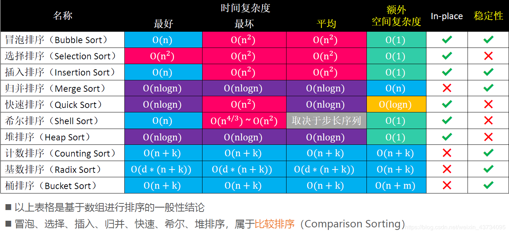

# iOS 面试-数据结构和算法

#### 常见的数据结构类型

```
1、集合结构：就是一个集合，就是一个圆圈中有很多个元素，元素与元素之间没有任何关系 这个很简单
2、线性结构：就是一个条线上站着很多个人。 这条线不一定是直的。也可以是弯的。也可以是直的 
相当于一条线被分成了好几段的样子。线性结构是一对一的关系
3、树形结构：做开发的肯定或多或少的知道 xml 解析 树形结构跟他非常类似。
也可以想象成一个金字塔。树形结构是一对多的关系
4、图形结构：比较复杂，无穷，无边，无向
```
#### 数据结构的存储方式

```
数据结构的存储一般常用的有两种 顺序存储结构 和 链式存储结构
```
#### 数组和链表区别

```
数组：数组元素在内存上连续存放，可以通过下标查找元素；
插入、删除需要移动大量元素，比较适用于元素很少变化的情况
链表：链表中的元素在内存中不是顺序存储的，查找慢，插入、删除只需要对元素指针重新赋值，效率高
```
#### 常用算法及其复杂度


#### 链表反转
```
//一个链表
struct Node {
    int data;
    struct Node *next;
};
//链表反转 1.迭代
struct Node *reverseList(struct Node *head) {
    struct Node *newH = NULL;
    while (head != NULL) {
        struct Node *temp = head->next;
        head->next = newH;
        newH = head;
        head = temp;
    }
    return newH;
}
//链表反转 2.递归
struct Node *reverseLiset2(struct Node *head) {
    if (head == NULL || head->next == NULL) {
        return head;
    }
    //注意,此处的操作是一直循环到链表末尾
    struct Node *newHead = reverseLiset2(head->next);
    head->next->next = head;
    head->next = NULL;
    return newHead;
}
```
#### 什么是二叉树
```
树形结构下，两个节点以内都称之为二叉树，不存在大于 2 的节点，分为左子树右子树有顺序不能颠倒
二叉树有五种表现形式：
1.空的树(没有节点)可以理解为什么都没
2.只有根节点。
3.只有左子树
4.只有右子树
5.左右子树都有 
```
#### 如何解决 Hash 碰撞冲突方法
```
1.开放定址法（线性探测，二次探测，伪随机探测）
开放定址法为减少冲突，要求装填因子 α 较小，故当结点规模较大时会浪费很多空间。
对增量 di 有三种取法：
di 称为增量序列。增量序列的取值方式不同，相应的再散列方式也不同
线性探测再散列 di = 1 , 2 , 3 , ... , m-1
冲突发生时，顺序查看表中下一单元，直到找出一个空单元或查遍全表。

平方探测再散列 di = 1 2 , -2 , 4 , -4 , 8 , -8 , ... , k的平方 ,  -k平方
冲突发生时，在表的左右进行跳跃式探测，比较灵活。

随机探测再散列 di 是一组伪随机数列
2.再哈希法
当发生冲突时，使用另一个哈希函数计算地址，直到无冲突时。
缺点：计算时间增加。
3.链地址法（拉链法）
将所有关键字为同义词的记录存储在同一线性链表中
优点：处理冲突简单，且无堆积现象，即非同义词决不会发生冲突，因此平均查找长度较短； 
由于拉链法中各链表上的结点空间是动态申请的，故它更适合于造表前无法确定表长的情况；
4.建立一个公共溢出区
假设哈希函数的值域为[0,m-1],则设向量 HashTable[0..m-1]为基本表，另外设立存储空间向量 OverTable[0..v]用以存储发生冲突的记录。
```

#### iOS 系统用到哈希相关的知识点
```
1. weak 底层采用的数据存储结构哈希表+数组
2. 关联对象 associate object 底层采用的数据结构哈希表
3. 字典的底层实现 哈希表 才有拉链法解决哈希冲突
4. @synchronized 哈希表
5. kvo 底层的数据存储
6. runloop 保存的全局字典和线程一一对应的关系
7. 引用计数表
```

### 算法学习参考
[算法代码在线演示](https://algorithm-visualizer.org)  
[数据结构和算法动态可视化](https://visualgo.net/zh)
[leetcode解题之路](https://github.com/azl397985856/leetcode)