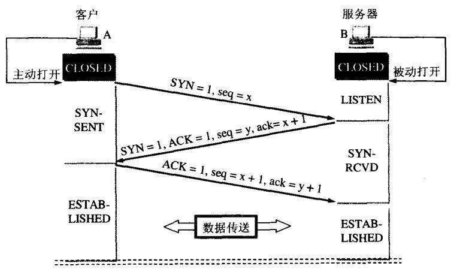
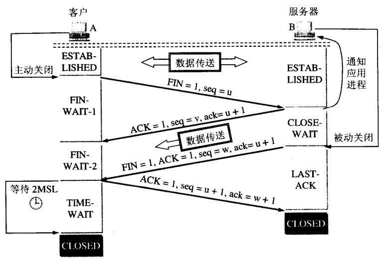
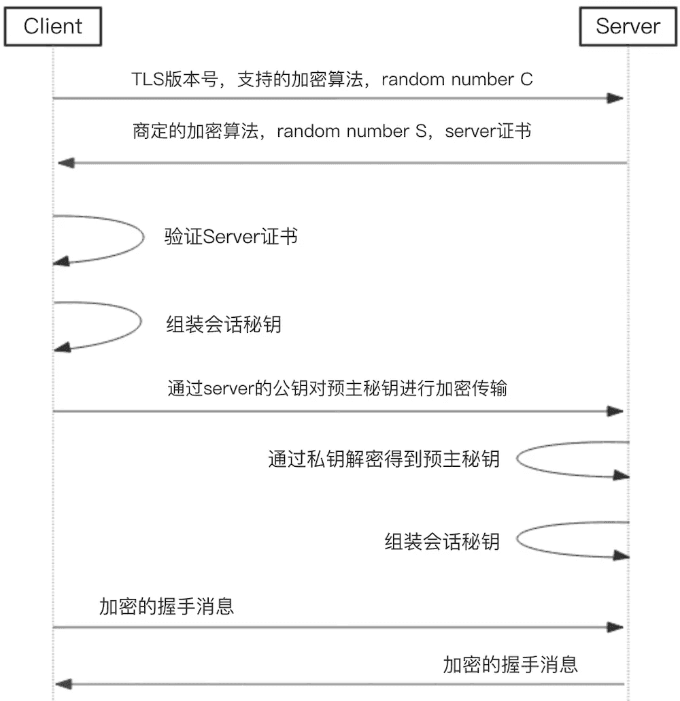
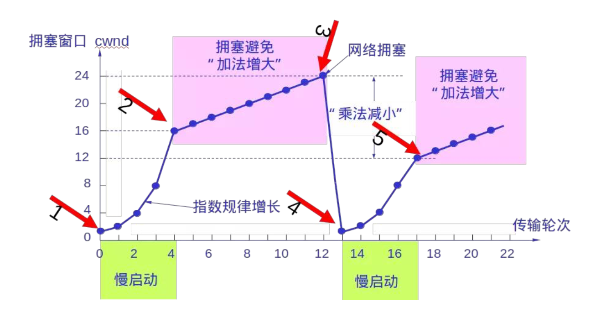
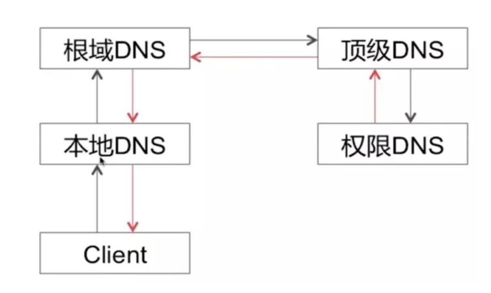
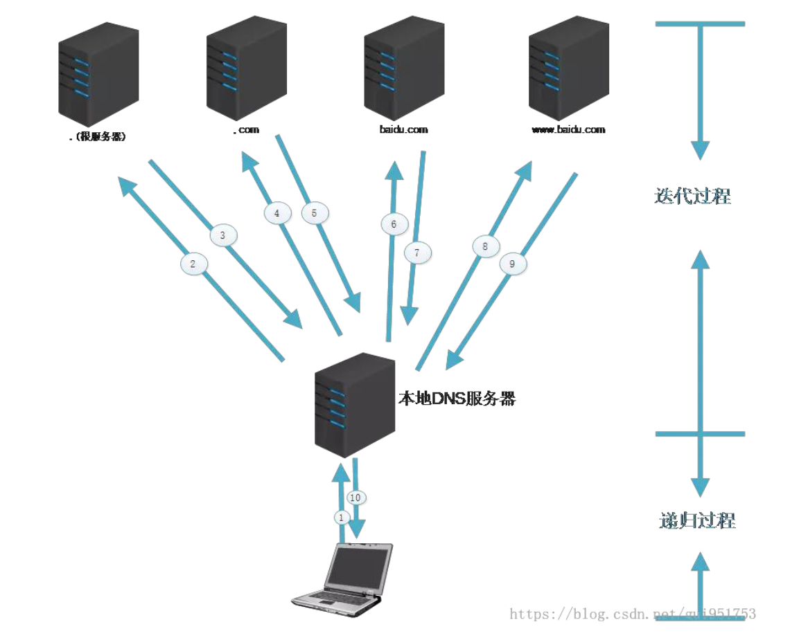
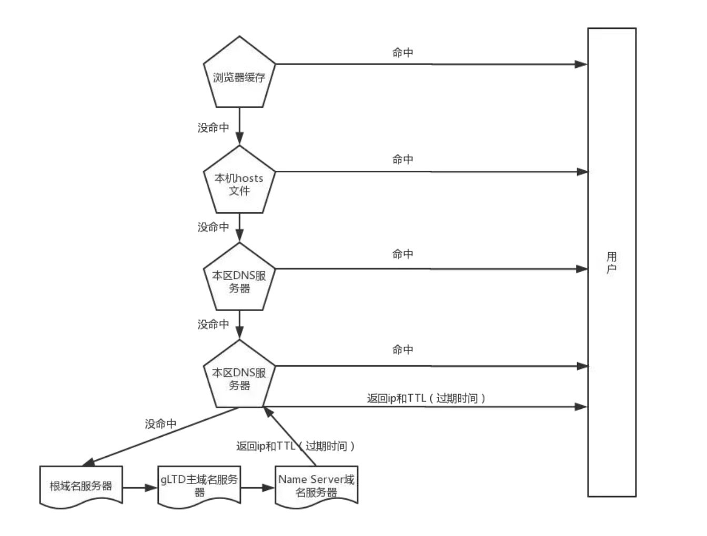

# iOS 面试-网络相关

- [网络的几层协议](#网络的几层协议)
- [GET 和 POST 区别](#get-和-post-区别)
- [常见的状态码](#常见的状态码)
- [HTTP 的特点](#http-的特点)
- [UDP 和 TCP 的区别是什么？](#udp-和-tcp-的区别是什么？)
- [Cookie 和 Session](#cookie-和-session)
- [TCP/IP 建立连接和断开连接的过程？](#tcpip-建立连接和断开连接的过程？)
- [为什么 TCP 连接建立需要三次握手](#为什么-tcp-连接建立需要三次握手)
- [为什么建立连接是三次握手，而关闭连接却是四次挥手呢？](#为什么建立连接是三次握手，而关闭连接却是四次挥手呢？)
- [为什么TIME_WAIT状态需要经过2MSL(最大报文段生存时间)才能返回到CLOSE状态？](#为什么TIME_WAIT状态需要经过2MSL(最大报文段生存时间)才能返回到CLOSE状态？)
- [HTTPS 建立流程](#https-建立流程)
- [对称加密和非对称加密](#对称加密和非对称加密)
- [可靠数据传输](#可靠数据传输)
- [流量控制](#流量控制)
- [拥塞控制](#拥塞控制)
- [DNS 是什么](#dns-是什么)
- [DNS 服务器](#dns-服务器)
- [DNS 解析过程](#dns-解析过程)
- [DNS 解析安全问题](#dns-解析安全问题)

#### 网络的几层协议
```
1.应用层：FTP、HTTP，也可以加上表示层：TIFF、JPEG|MPEG 会话层：RPC、SQL
2.传输层：TCP、UDP
3.网络层：IP、IPX、ICMP；
4.数据链路层：802.2、802.3ATM
5.物理层：V.35、EIA/TIA-232

另外 SSL 协议位于 TCP/IP 协议与各种应用层协议之间，为数据通讯提供安全支持。
SSL 协议可分为两层：
SSL记录协议（SSL Record Protocol）：它建立在可靠的传输协议（如 TCP）之上，为高层协议提供数据封装、压缩、加密等基本功能的支持。
SSL 握手协议（SSL Handshake Protocol）：它建立在 SSL 记录协议之上，用于在实际的数据传输开始前，通讯双方进行身份认证、协商加密算法、交换加密密钥等。
TLS 与 SSL 在传输层与应用层之间对网络连接进行加密。SSL 协议工作在应用层与传输层之间。
```

#### GET 和 POST 区别
```
常见的请求方式：GET、POST、PUT、DELETE、HEAD、OPTIONS

参数携带方式不同：GET 是以？拼接的方式，POST 是在 body 中
参数长度限制：GET 一般限制 2048 字符(这里是 IE 浏览器的限制)，POST 一般没有限制
GET：获取资源，他是安全的，幂等的，可缓存的
POST：处理资源，他是非安全的，非幂等的，非可缓存的
安全性：不引起 server 端任何状态变化。如 GET、HEAD、OPTIONS
幂等性：同一个请求方法执行多次和执行一次的效果完全相同。如：GET、PUT、DELETE
可缓存行：请求是否可以缓存。如：GET、HEAD

GET 和 POST 本质上就是 TCP 链接，并无差别。
但是由于 HTTP 的规定和浏览器/服务器的限制，导致他们在应用过程中体现出一些不同。
在响应时，GET 产生一个 TCP 数据包;POST 产生两个 TCP 数据包:
对于 GET 方式的请求，浏览器会把 Header 和实体主体一并发送出去，服务器响应 200(返回数据); 
而对于 POST，浏览器先发送 Header，服务器响应 100 Continue，浏览器再发送实体主体，服务器响应 200 OK(返回数据)。
```
#### 常见的状态码
```
200 OK:请求成功，信息在返回的响应报文中
301 MovedPermanently: 请求的对象已经被永久转移了，新的URL定义在响应报文中的Location:
首部行中。客户软件将自动获取新的 URL。适合永久重定向。
302 302用来做临时跳转
400 BadRequest:一个通用差错代码，指示该请求不能被服务器理解
404 NotFound:被请求的文件不在服务器上
505 HTTPVersionNotSupported:服务器不支持请求报文使用的HTTP协议版本
<4 开头的状态码通常是客户端的问题，5 开头的则通常是服务端的问题>
```
#### HTTP 的特点
```
HTTP：超文本传输协议 (hypertext transport protocol)：无连接、 无状态
HTTP 的持久连接、Cookie/Session
1、HTTP 的无状态
即协议对于事务处理没有记忆能力。每次的请求都是独立的，它的执行情况和结果与
前面的请求和之后的请求时无直接关系的，它不会受前面的请求应答情况直接影响，
也不会直接影响后面的请求应答情况也就是说服务器中没有保存客户端的状态，
客户端必须每次带上自己的状态去请求服务器
标准的 HTTP 协议指的是不包括 cookies，session，application 的 HTTP 协议
2、HTTP 的持久连接
非持久连接:每个连接处理一个请求-响应事务。 
持久连接:每个连接可以处理多个请求-响应事务。

持久连接情况下，服务器发出响应后让 TCP 连接继续打开着。
同一对客户/服务器之间的后续请求和响应 可以通过这个连接发送。
HTTP/1.0 使用非持久连接。HTTP/1.1 默认使用持久连接<keep-alive>。
非持久连接的每个连接，TCP 得在客户端和服务端分配 TCP 缓冲区，并维持 TCP 变量，会严重增加服务器负担。
而且每个对象都有 2 个 RTT(Round Trip Time，也就是一个数据包从发出去到回来的时间)的延迟， 
由于 TCP 的拥塞控制方案,每个对象都遭受 TCP 缓启动，因为每个 TCP 连接都起始于缓启动阶段

HTTP 持久连接怎么判断一个请求是否结束的?
Content-length: 根据所接收字节数是否达到 Content-length 值
chunked(分块传输): Transfer-Encoding。当选择分块传输时，响应头中可以不包含
Content-Length，服务器会先回复一个不带数据的报文(只有响应行和响应头和\r\n)，然后开始传输若干个数据块。
当传输完若干个数据块后，需要再传输一个空的数据块，当客户端收到空的数据块时，则客户端知道数据接收完毕。

请求报文：请求方法， HTTP 版本号
请求头：Host: 指明了该对象所在的主机
Connection:Keep-Alive 首部行用来表明该浏览器告诉服务器使用持续连接
Content-Type: x-www-form-urlencoded 首部行用来表明 HTTP 会将请求参数用 key1=val1&key2=val2 的方式
进行组织，并放到请求实体里面 User-agent:首部行用来指明用户代理，即向服务器发送请求的浏览器类型 Accept-lauguage:首部行表示用户想得到的语言或语言组合，否则，服务器应发送它的默认版本
```
#### UDP 和 TCP 的区别是什么？
```
TCP（传输控制协议）：面向连接：三次握手，四次挥手
传输可靠：通过停止等待协议，保证数据无差错、不丢失、不重复、按序到达
面向字节流
流量控制：滑动窗口协议，简单的说一下就是接收端在发送 ACK 的时候会带上缓冲区的窗口大小，
但是一般在窗口达到一定大小才会更新窗口
拥塞控制：慢开始，拥塞避免；快恢复，快重传

UDP（用户数据报协议）：无连接、传输不可靠、用于传输少量数据(数据包模式)、面向报文、速度快。
```
#### Cookie 和 Session
```
1、cookie 数据存放在客户的浏览器上，session 数据放在服务器上。

2、cookie 相比 session 不是很安全，别人可以分析存放在本地的 cookie 并进行 cookie 欺骗,
考虑到安全应当使用 session。

3、session 会在一定时间内保存在服务器上。当访问增多，会比较占用你服务器的性能,
考虑到减轻服务器性能方面，应当使用 cookie。

4、单个 cookie 保存的数据不能超过 4K，很多浏览器都限制一个站点最多保存20个 cookie。
 而 session 存储在服务端，可以无限量存储

5、所以：将登录信息等重要信息存放为 session ;其他信息如果需要保留，可以放在 cookie 中
```
#### TCP/IP 建立连接和断开连接的过程？
```
- 在 TCP/IP 协议中，TCP 协议提供可靠的连接服务，采用三次握手建立连接；
- 第一次握手：建立连接时，客户端发送连接请求到服务器，并进入 SYN_SEND 状态，等待服务器确认；
- 第二次握手：服务器收到客户端连接请求，向客户端发送允许连接应答，
  此时服务器进入 SYN_RECV 状态；
- 第三次握手：客户端收到服务器的允许连接应答，向服务器发送确认，客户端和服务器进入通信状态，
  完成三次握手。
 （所谓的三次握手，就是要有三次连接信息的发送、接收过程。
   TCP 连的建立需要进行三次连接信息的发送、接收。）

当客户端和服务端的连接想要断开的时候，要经历四次挥手的过程，步骤如下：
1. 先由客户端向服务端发送 FIN 结束报文。
2. 服务端会返回给客户端 ACK 确认报文 。此时，由客户端发起的断开连接已经完成。
3. 服务端会发送给客户端 FIN 结束报文 和 ACK 确认报文。
4. 客户端会返回 ACK 确认报文到服务端，至此，由服务端方向的断开连接已经完成。

几个概念：URG：紧急指针（urgent pointer）有效。
seq：序列号：用来标识从 TCP 发端向 TCP 收端发送的数据字节流,它表示在这个报文段中的的第一个数据字节
ACK：确认序号有效。
PSH：接收方应该尽快将这个报文交给应用层。
RST：重置连接。
SYN：发起一个新连接。
FIN：释放一个连接。
```



#### 为什么 TCP 连接建立需要三次握手
```
“三次握手”的目的是“为了防止已失效的连接请求报文段突然又传送到了服务端，因而产生错误”。
如：“已失效的连接请求报文段”的产生在这样一种情况下：client 发出的第一个连接请求报文段并没有丢失，
而是在某个网络结点长时间的滞留了，以致延误到连接释放以后的某个时间才到达 server。
本来这是一个早已失效的报文段。但 server 收到此失效的连接请求报文段后，
就误认为是 client 再次发出的一个新的连接请求。
于是就向 client 发出确认报文段，同意建立连接。假设不采用“三次握手”，那么只要 server 发出确认，
新的连接就建立了。
由于现在 client 并没有发出建立连接的请求，因此不会理睬 server 的确认，也不会向 server 发送数据。
但 server 却以为新的运输连接已经建立，并一直等待 client 发来数据。
这样，server 的很多资源就白白浪费掉了。
采用 “三次握手” 的办法可以防止上述现象发生。例如刚才那种情况，client 不会向 server 的确认发出确认。
server 由于收不到确认，就知道 client 并没有要求建立连接。
综合：只需要三次握手，可以提高连接的速度与效率。
```
#### 为什么建立连接是三次握手，而关闭连接却是四次挥手呢？
```
这是因为服务端在 LISTEN 状态下，收到建立连接请求的 SYN 报文后，
把 ACK 和 SYN 放在一个报文里发送给客户端。
而关闭连接时，当收到对方的 FIN 报文时，仅仅表示对方不再发送数据了但是还能接收数据，
我们也未必全部数据都发送给对方了，
所以我们不可以立即 close，也可以发送一些数据给对方后，再发送 FIN 报文给对方来表示同意现在关闭连接，
因此，我们的 ACK 和 FIN 一般都会分开发送。
```
#### 为什么TIME_WAIT状态需要经过2MSL(最大报文段生存时间)才能返回到CLOSE状态？
```
我们必须假象网络是不可靠的。如果客户端发送出最后的 ACK 回复，服务器没有收到，服务器将不断重复发送 FIN报文。所以客户端不能立即关闭，它必须确认服务器端接收到了该 ACK。
客户端会在发送出 ACK 之后进入到 TIME_WAIT 状态，同时设置一个计时器，等待 2MSL 的时间。如果在该时间内再次收到 FIN，那么客户端会重发 ACK 并再次等待 2MSL。
所谓的 2MSL 是两倍的 MSL(Maximum Segment Lifetime)。MSL 指一个片段在网络中最大的存活时间，2MSL 就是一个发送和一个回复所需的最大时间。如果直到 2MSL，客户端都没有再次收到 FIN，那么客户端推断 ACK 已经被成功接收，则结束 TCP 连接。
```

#### HTTPS 建立流程
```
HTTPS 协议 = HTTP 协议 + SSL/TLS 协议
SSL 的全称是 Secure Sockets Layer，即安全套接层协议，
是为网络通信提供安全及数据完整性的一种安全协议。
TLS 的全称是 Transport Layer Security，即安全传输层协议。
即 HTTPS 是安全的 HTTP。
HTTPS 连接过程大致可分为八步:

1、客户端访问 HTTPS 连接。
客户端会把安全协议版本号、客户端支持的加密算法列表、随机数 C 发给服务端。

2、服务端发送证书给客户端
服务端接收密钥算法配件后，会和自己支持的加密算法列表进行比对，如果不符合，则断开连接。
否则，服务端会在该算法列表中，选择一种对称算法（如 AES）、一种公钥算法（如具有特定秘钥长度的 RSA）
和一种 MAC 算法发给客户端。
服务器端有一个密钥对，即公钥和私钥，是用来进行非对称加密使用的，服务器端保存着私钥，
不能将其泄露，公钥可以发送给任何人。
在发送加密算法的同时还会把数字证书和随机数 S 发送给客户端

3、客户端验证 server 证书
会对 server 公钥进行检查，验证其合法性，如果发现发现公钥有问题，那么 HTTPS 传输就无法继续。

4、客户端组装会话秘钥
如果公钥合格，那么客户端会用服务器公钥来生成一个预主秘钥(Pre-Master Secret，PMS)，
并通过该预主秘钥和随机数 C、S 来组装成会话秘钥

5、客户端将预主秘钥加密发送给服务端
是通过服务端的公钥来对预主秘钥进行非对称加密，发送给服务端

6、服务端通过私钥解密得到预主秘钥
服务端接收到加密信息后，用私钥解密得到预主秘钥。

7、服务端组装会话秘钥
服务端通过预主秘钥和随机数 C、S 来组装会话秘钥。
至此，服务端和客户端都已经知道了用于此次会话的主秘钥。

8、数据传输
客户端收到服务器发送来的密文，用客户端密钥对其进行对称解密，得到服务器发送的数据。
同理，服务端收到客户端发送来的密文，用服务端密钥对其进行对称解密，得到客户端发送的数据。

总结：
会话秘钥 = random S + random C + 预主秘钥

HTTPS 连接建立过程使用非对称加密，而非对称加密是很耗时的一种加密方式

后续通信过程使用对称加密，减少耗时所带来的性能损耗

其中，对称加密加密的是实际的数据，非对称加密加密的是对称加密所需要的客户端的密钥。
```


#### 对称加密和非对称加密
```
1、对称加密: 用同一套密钥来进行加密解密。
对称加密通常有 DES,IDEA,3DES 加密算法。
2、非对称加密
用公钥和私钥来加解密的算法。
公钥(Public Key)与私钥(Private Key)是通过一种算法得到的一个密钥对(即一个公钥和一个私钥)， 
公钥是密钥对中公开的部分，私钥则是非公开的部分,私钥通常是保存在本地。
用公钥进行加密，就要用私钥进行解密;反之，用私钥加密，就要用公钥进行解密(数字签名)。
由于私钥是保存在本地的，所以非对称加密相对与对称加密是安全的。
但非对称加密比对称加密耗时, 所以通常要结合对称加密来使用。 
常见的非对称加密算法有: RSA、ECC(移动设备用)、Diffie-Hellman、El Gamal、DSA(数字签名用)
而为了确保客户端能够确认公钥就是想要访问的网站的公钥，引入了数字证书的概念，
由于证书存在一级一级的签发过程，所以就出现了证书链，在证书链中的顶端的就是根 CA。
```
#### 可靠数据传输

```
网络层服务(IP 服务)是不可靠的。IP 不保证数据报的交付，不保证数据报的按序交付，也不保证数据报中数据的完整性。
TCP 则是在 IP 服务上创建了一种可靠数据传输服务
TCP 的可靠数据传输服务确保一个进程从其接收缓存中读出的数据流是无损坏、无间隔、无冗余、按序的数据流。
即该字节流与连接的另一端发出的字节流是完全相同的。
通过超时重传，能保证接收到的数据是无损坏、无冗余的数据流，但并不能保证按序。
而通过 TCP 滑动窗口，能够有效保证接收数据有序
```
#### 流量控制
```
流量控制是一个速度匹配服务，即发送方的发送速率与接收方应用程序的读取速率相匹配。 
作为全双工协议，TCP 会话的双方都各自维护一个发送窗口和一个接收窗口(receive window)的变量来提供流量控制。
而发送窗口的大小是由对方接收窗口来决定的，接收窗口用于给发送方一个指示--该接收方还有多少可用的缓存空间。
```
#### 拥塞控制
```
TCP 除了可靠传输服务外，另一个关键部分就是拥塞控制。
TCP 让每一个发送方根据所感知到的网络拥塞程度来限制其能向连接发送流量的速率。
1、TCP 发送方如何感知网络拥塞?
冗余 ACK(duplicate ACK): 就是再次确认某个报文段的 ACK，而发送方先前已经收到对该报文段的确认。
冗余 ACK 的产生原因:
1.当接收端接收到失序报文段时，即该报文段序号大于下一个期望的、按序的报文段，
检测到数据流中的间隔，即由报文段丢失，并不会对该报文段确认。
TCP 不使用否定确认，所以不能向发送方发送显式的否定确认，为了使接收方得知这一现象，
会对上一个按序字节数据进行重复确认，这也就产生 了一个冗余 ACK。
2.因为发送方经常发送大量的报文段，如果其中一个报文段丢失，可能在定时器过期前，
就会收到大量的冗余 ACK。一旦收到 3 个冗余 ACK(3 个以下很可能是链路层的乱序引起的，无需处理)，
说明在这个已被确认 3 次的报文段之后的报文段已经丢失，TCP 就会执行快速重传，
即在该报文段的定时 器过期之前重传丢失的报文段。
将 TCP 发送方的丢包事件定义为:要么出现超时，要么收到来自接收方的 3 个冗余 ACK。 
当出现过度的拥塞时，路由器的缓存会溢出，导致一个数据报被丢弃。丢弃的数据报接着会引起发送方的丢包事件。
那么此时，发送方就认为在发送方到接收方的路径上出现了网络拥塞。

TCP 发送方如何限制其向连接发送流量的速率?
当出现丢包事件时: 应当降低 TCP 发送方的速率。
当对先前未确认报文段的确认到达时，即接收到非冗余 ACK 时，应当增加发送方的速率。

发送方感知到网络拥塞时，采用何种算法来改变其发送速率?
即 TCP 拥塞控制算法(TCP congestion control algorithm)
包括三个主要部分:慢启动、拥塞避免、快速恢复，其中快速恢复并非是发送方必须的，
慢启动和拥塞避免则是 TCP 强制要求的
```


#### DNS 是什么
```
DNS 是:域名系统(Domain Name System)
1、一个由分层的 DNS 服务器实现的分布式数据库 
2、一个使得主机能够查询分布式数据库的应用层协议
而 DNS 服务器通常是运行 BIND 软件的 UNIX 机器，DNS 协议运行在 UDP 上，使用 53 号端口
DNS 通常是由其他应用层协议所使用的，包括 HTTP、SMTP 等。其作用则是:将用户提供的主机名解析为 IP 地址
DNS 被设计成了一个分布式、层次数据库
```
#### DNS 服务器

```
目前的 DNS 服务器大致分为 3 种类型的 DNS 服务器:根 DNS 服务器、顶级域 DNS 服务器、权威 DNS 服务器
```
#### DNS 解析过程

```
DNS 查询：
1、迭代查询:本地 DNS 服务器-->根 DNS 服务器-->顶级域 DNS 服务器-->权威 DNS 服务器,所有查询都是递归的。
2.这种利用了迭代查询和递归查询，从 Client 与本地 DNS 之间是递归查询，其余则是迭代查询。
所谓递归查询过程就是 “查询的递交者” 更替, 而迭代查询过程 则是 “查询的递交者”不变。 
从理论上讲，任何 DNS 查询既可以是迭代的也能是递归的。
而在实际过程中，更常用的是图上从请求主机到本地 DNS 服务器的查询是递归，其余查询是迭代的这种方式。

DNS 缓存(DNS Caching):为了改善时延性能并减少在因特网上到处传输的 DNS 报文数量，DNS 广泛使用了缓存技术。
有 DNS 的地方，就有缓存。浏览器、操作系统、本地 DNS 服务器、根 DNS 服务器，
它们都 会对 DNS 结果做一定程度的缓存。

DNS 解析过程：
1、发起基于域名的请求后，首先检查本地缓存(浏览器缓存-->操作系统的 hosts 文件)
2、如果本地缓存中有，直接返回目标 IP 地址，否则将域名解析请求发送给本地 DNS 服务器
3、如果本地 DNS 服务器中有，直接返回目标 IP 地址，到这一步基本能解析 80% 的域名。如
果没有，本地 DNS 服务器将解析请求发送给根 DNS 服务器
4、根 DNS 服务器会返回给本地 DNS 服务器一个所查询的 TLD 服务器地址列表
5、本地 DNS 服务器再向上一步返回的 TLD 服务器发送请求，TLD 服务器查询并返回域名对
  应的权威域名服务器的地址
6、本地 DNS 服务器再向上一步返回的权威域名服务器发送请求，权威域名服务器会查询存
储的域名和 IP 的映射关系表，将 IP 连同一个 TTL(过期时间)值返回给本地 DNS 服务器
7、本地 DNS 服务器会将 IP 和主机名的映射保存起来，保存时间由TTL来控制
8、本地 DNS 服务器把解析的结果返回给用户，用户根据 TTL 值缓存在本地系统缓存中，域名解析过程结束
```




#### DNS 解析安全问题
```
1、DNS 劫持:
一种可能的域名劫持方式即黑客侵入了宽带路由器并对终端用户的本地 DNS 服务器进行篡改，
指向黑客自己伪造的本地 DNS 服务器，进而通过控制本地 DNS 服务器的逻辑返回错误的 IP 信息进行域名劫持。
另一方面，由于 DNS 解析主要是基于 UDP 协议，除了上述攻击行为外，
攻击者还可以监听终端用户的域名解析请求，并在本地 DNS 服务器返回正确结果之前
将伪造的 DNS 解析响应传递给终端用户，进而控制终端用户的域名访问行为。
2、缓存污染(DNS 污染):
我们知道在接收到域名解析请求时，本地 DNS 服务器首先会查找缓存，如果缓存命中就会直接返回缓存结果，
不再进行递归 DNS 查询。这时候如果本地 DNS 服务器针对部分域名的缓存进行更改，
比如将缓存结果指向第三方的广告页，就会导致用户的访问请求被引导到这些广告页地址上。
3、如何解决 DNS 劫持
DNS 解析发生在 HTTP 协议之前，DNS 解析和 DNS 劫持和 HTTP 没有关系，
DNS 协议使用的是 UDP 协议向服务器的 53 端口进行请求。
要想解决 DNS 劫持:
1.可以使用 HttpDNS 的方案:使用 HTTP 协议向 DNS 服务器的 80 端口进行请求,来规避 DNS 劫持
2.在终端上，可以更换 DNS 服务器，不管手机还是电脑，都能手动配置 DNS
```

#### 学习参考
[计算机网络](https://www.bilibili.com/video/BV1Hx411D7rn?p=1)  
[计算机网络太难？了解这一篇就够了](https://juejin.im/post/6844903951335178248)