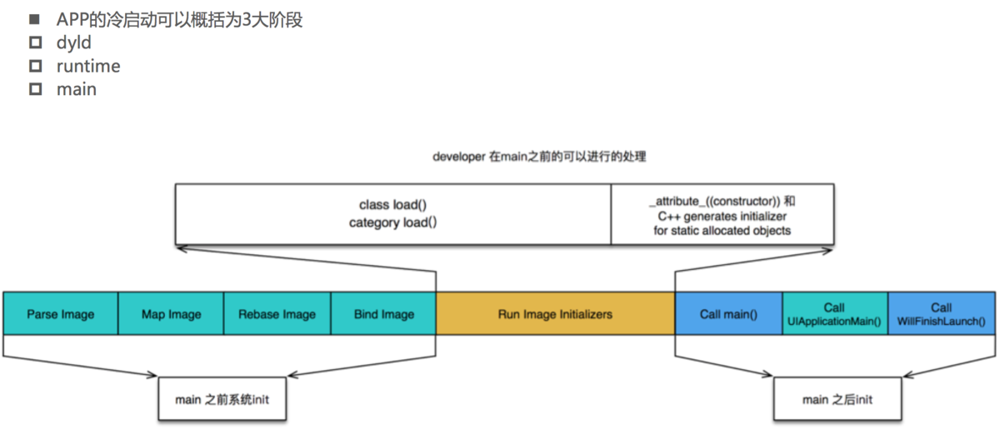

# iOS 面试 - 性能优化

- [常见的优化方式](#常见的优化方式)
- [造成 tableView 卡顿的原因有哪些？](#造成-tableView-卡顿的原因有哪些？)
- [优化 tableView 的方式](#优化-tableView-的方式)
- [什么是离屏渲染？什么情况下会触发？该如何应对？](#什么是离屏渲染？什么情况下会触发？该如何应对？)
- [如何检测离屏渲染](#如何检测离屏渲染)
- [如何检查内存泄露](#如何检查内存泄露)
- [耗电网络优化](#耗电网络优化)
- [APP 启动时间应从哪些方面优化？](#app-启动时间应从哪些方面优化？)
- [如何有效降低 APP 包的大小？](#如何有效降低-app-包的大小？)
- [如何检测未使用的代码](#如何检测未使用的代码)
- [如何高性能的画一个圆角](#如何高性能的画一个圆角)
- [怎么检测图层混合](#怎么检测图层混合)
- [代码如何转换为可执行文件或者 ipa 包](#代码如何转换为可执行文件或者-ipa-包)

#### 常见的优化方式
```
1、用 ARC 管理内存：避免内存泄漏
2、优化 TableView
3、避免过于庞大的 XIB
4、不要阻塞主线程
5、在 ImageViews 中调整图片大小
6、选择正确的数据结构
7、重用和延迟加载(lazy load) Views
8、正确使用缓存
9、避免反复处理数据
10、选择正确的数据存储方式：
NSUserDefaults：小数据
归档解归档
数据库：SQLite、CoreData、Realm
11、启动时间优化
12、选择是否缓存图片。常见的从 bundle 中加载图片的方式有两种，
一个是用 imageNamed：会缓存图片，
二是用 imageWithContentsOfFile，第一种比较常见一点。
13、避免大量日期格式转换。
```
#### 造成 tableView 卡顿的原因有哪些？
```
1、cell 没有重用
2、避免 cell 重写布局
3、cell 行高不固定
4、cell 控件过多
5、透明背景导致
6、图片下载没有异步处理
7、动态添加 cell 上的控件 
8、有其他绘制工作
```
#### 优化 tableView 的方式
```
本质上是降低 CPU、GPU 的工作，从这两个大的方面去提升性能。
CPU：对象的创建和销毁、对象属性的调整、布局计算、文本的计算和排版、图片的格式转换和解码、图像的绘制
GPU：纹理的渲染
CPU 方面优化：
1、用轻量级的对象：比如用不到事件处理的地方，可以考虑使用 CALayer 取代 UIView
2、不要频繁地调用 UIView 的相关属性，比如 frame、bounds、transform 等属性，尽量减少不必要的修改
3、尽量提前计算好布局，在有需要时一次性调整对应的属性，不要多次修改属性
4、图片的 size 最好刚好跟 UIImageView 的 size 保持一致
5、尽量把耗时的操作放到子线程：尺寸计算、绘制、图片下载解码、绘制
GPU 优化：
1、尽量避免短时间内大量图片的显示，尽可能将多张图片合成一张进行显示
2、GPU 能处理的最大纹理尺寸是 4096x4096，一旦超过这个尺寸，就会占用 CPU 资源进行处理，
所以纹理尽量不要超过这个尺寸
3、尽量减少视图数量和层次
4、减少透明的视图（alpha<1），不透明的就设置 opaque 为 YES
5、尽量避免出现离屏渲染
其他方面：
1、正确使用 reuseIdentifier 来重用 cells
2、缓存行高
3、如果 cell 内现实的内容来自 web，使用异步加载，缓存请求结果
4、尽量不要动态的 add 或者 remove 子控件。最好在初始化时就添加完，然后通过 hidden 来控制是否显示。
```
#### 什么是离屏渲染？什么情况下会触发？该如何应对？
```
在 OpenGL 中，GPU 有 2 种渲染方式
On-Screen Rendering：当前屏幕渲染，在当前用于显示的屏幕缓冲区进行渲染操作
Off-Screen Rendering：离屏渲染，在当前屏幕缓冲区以外新开辟一个缓冲区进行渲染操作
为什么需要离屏渲染：
目的在于当使用圆角，阴影，遮罩的时候，图层属性的混合体被指定为在未预合成之前不能直接在屏幕中绘制，
即当主屏的还没有绘制好的时候，所以就需要屏幕外渲染，最后当主屏已经绘制完成的时候，再将离屏的内容转移至主屏上。
另外：对于 Offscreenbuffer 中存储的数据的缓存时间是 100ms，如果没有使用那么它就会丢弃。
离屏渲染缓存空间有限，超过2.5倍屏幕像素大小的话，也会失效，且无法进行复用了。

离屏渲染消耗性能的原因:
1.需要创建新的缓冲区
2.离屏渲染的整个过程，需要多次切换上下文环境，先是从当前屏幕（On-Screen）切换到离屏（Off-Screen）
等到离屏渲染结束以后，将离屏缓冲区的渲染结果显示到屏幕上，又需要将上下文环境从离屏切换到当前屏幕
哪些操作会触发离屏渲染:
光栅化，layer.shouldRasterize = YES
遮罩，layer.mask
设置了组透明度为 YES，并且透明度不为 1 的 layer (layer.allowsGroupOpacity/ layer.opacity)
圆角，同时设置 layer.masksToBounds = YES、layer.cornerRadius 大于 0 ，有可能触发（多个图层才会触发）
更详细：
a.按钮视图设置图片，并且设置圆角 cornerRadius 和裁剪 masksToBounds，会产生离屏渲染
b.按钮视图不设置图片，设置圆角 cornerRadius 和裁剪 masksToBounds，不会产生离屏渲染
c.图片视图不设置背景色，设置圆角 cornerRadius 和裁剪 masksToBounds，不会产生离屏渲染
d.图片视图设置背景色，设置圆角 cornerRadius 和裁剪 masksToBounds，会产生离屏渲染
阴影，layer.shadowXXX，如果预先设置了阴影的几何形状（layer.shadowPath）就不会产生离屏渲染
圆角离屏渲染解决：考虑通过 CoreGraphics 绘制裁剪圆角，或者叫美工提供圆角图片
```
#### 如何检测离屏渲染
```
1、模拟器 debug 选中 Color Offscreen - Renderd 离屏渲染的图层高亮成黄, 可能存在性能问题 
2、真机 Instrument 选中 Core Animation 勾选 Color Offscreen-Rendered Yellow
```
#### 如何检查内存泄露
```
系统工具：Xcode 的 Instruments 的 Time profiler (程序耗时检测), 
Core Animation(检测刷新帧率)，Leaks（内存泄漏检测）
第三方库：MLeaksFinder
```
#### 耗电网络优化
```
CPU 处理，Processing
网络，Networking
定位，Location
图像，Graphics
耗电优化:
1、尽可能降低 CPU、GPU 功耗, 少用定时器
优化 I/O 操作:
1、尽量不要频繁写入小数据，最好批量一次性写入
2、读写大量重要数据时，考虑用 dispatch_io，其提供了基于 GCD 的异步操作文件 I/O 的 API。
用 dispatch_io 系统会优化磁盘访问
3、数据量比较大的，建议使用数据库（比如 SQLite、CoreData）
网络优化:
1、减少、压缩网络数据
2、如果多次请求的结果是相同的，尽量使用缓存
3、使用断点续传，否则网络不稳定时可能多次传输相同的内容
4、网络不可用时，不要尝试执行网络请求
5、让用户可以取消长时间运行或者速度很慢的网络操作，设置合适的超时时间
6、批量传输
定位优化:
1、如果只是需要快速确定用户位置，最好用 CLLocationManager 的 requestLocation 方法。
定位完成后，会自动让定位硬件断电
2、如果不是导航应用，尽量不要实时更新位置，定位完毕就关掉定位服务
3、尽量降低定位精度，比如尽量不要使用精度最高的 kCLLocationAccuracyBest
4、需要后台定位时，尽量设置 pausesLocationUpdatesAutomatically 为 YES，
5、如果用户不太可能移动的时候系统会自动暂停位置更新
尽量不要使用 startMonitoringSignificantLocationChanges，优先考虑 startMonitoringForRegion:
硬件检测优化：
用户移动、摇晃、倾斜设备时，会产生动作 (motion) 事件，这些事件由加速度计、陀螺仪、磁力计等硬件检测。
在不需要检测的场合，应该及时关闭这些硬件
```
#### APP 启动时间应从哪些方面优化？
```
APP 的启动可以分为 2 种
冷启动（Cold Launch）：从零开始启动 APP
热启动（Warm Launch）：APP 已经在内存中，在后台存活着，再次点击图标启动 APP

APP 启动时间的优化，主要是针对冷启动进行优化

通过添加环境变量可以打印出 APP 的启动时间分析（Edit scheme -> Run -> Arguments）
DYLD_PRINT_STATISTICS 设置为 1
如果需要更详细的信息，那就将 DYLD_PRINT_STATISTICS_DETAILS 设置为 1
或者使用：Instruments - Time Profiler 进行检测

dyld（dynamic link editor）：Apple 的动态链接器，可以用来装载 Mach-O 文件（可执行文件、动态库等）
启动 APP 时，dyld 所做的事情有：
1、装载 APP 的可执行文件(可执行文件包含代码和动态库依赖信息)，同时会递归加载所有依赖的动态库
2、rebase/binding （可执行文件和动态链接库在虚拟内存中的加载地址每次启动都不固定，所以需要这2步来修复镜像中的资源指针，来指向正确的地址。 rebase 修复的是指向当前镜像内部的资源指针；而 bind 指向的是镜像外部的资源指针。）
3、当 dyld 把可执行文件、动态库都装载完毕后，会通知 Runtime 进行下一步的处理


启动 APP 时，runtime 所做的事情有：
调用 map_images 进行可执行文件内容的解析和处理
在 load_images 中调用 call_load_methods，调用所有 Class 和 Category 的 +load 方法
进行各种 objc 结构的初始化（注册 Objc 类 、初始化类对象等等）
调用 C++ 静态初始化器和 attribute((constructor)) 修饰的函数
到此为止，可执行文件和动态库中所有的符号 (Class，Protocol，Selector，IMP，…) 
都已经按格式成功加载到内存中，被 runtime 所管理。

总结：
1、APP 的启动由 dyld 主导，将可执行文件加载到内存，顺便加载所有依赖的动态库
2、并由 runtime 负责加载成 objc 定义的结构
3、所有初始化工作结束后，dyld 就会调用 main 函数
4、接下来就是 UIApplicationMain 函数，AppDelegate 的 application:didFinishLaunchingWithOptions: 方法

启动优化：
按照不同的阶段
dyld：
1、减少动态库、合并一些动态库（定期清理不必要的动态库）
2、减少 Objc 类、分类的数量、减少 Selector 数量（定期清理不必要的类、分类）, 
装在可执行文件时候有加载类分类的操作
3、减少 C++ 虚函数数量

runtime：
少在 +load 方法里写逻辑代码可以用 +initialize 方法和 dispatch_once 取代

main：
在不影响用户体验的前提下，尽可能将一些操作延迟，不要全部都放在 finishLaunching 方法中
按需加载
其他优化方案：二进制重排，PGO
```
[App 启动时间优化  二进制重排和 PGO](https://www.jianshu.com/p/07bb4c99252c)  
[抖音研发实践：基于二进制文件重排的解决方案](https://mp.weixin.qq.com/s?__biz=MzI1MzYzMjE0MQ==&mid=2247485101&idx=1&sn=abbbb6da1aba37a04047fc210363bcc9&scene=21#wechat_redirect)
[优化 App 的启动时间](http://yulingtianxia.com/blog/2016/10/30/Optimizing-App-Startup-Time/)



#### 如何有效降低 APP 包的大小？
```
安装包（IPA）主要由可执行文件 (源代码文件 编译链接生产的)、资源(图片 音视频 stroyboard xib) 组成
项目编译完生产 app 文件, app 文件压缩后成 IPA 文件
1、资源（图片、音频、视频等）采取无损压缩
2、去除没有用到的资源： https://github.com/tinymind/LSUnusedResources
3、编译器优化
Deployment Postprocessing 和 Strip Linked Product，两个需要都设置为 YES 才有用。
原理是打开这两个选项后构建 ipa 会去除掉 symbol 符号，就是类名函数名。
这样子的影响就是运行时你没法进行线程回溯，符号都没了回溯了也是乱码。但是不会影响正常的崩溃日志生成和解析。
4、利用 AppCode（https://www.jetbrains.com/objc/）检测未使用的代码：菜单栏 -> Code -> Inspect Code
5、手动移除代码：
梳理项目里的第三方代码, 没有直接用的全部删除.
梳理用到的第三方代码, 如果有功能类似的, 移除一个.
如果只使用了第三方一部分代码, 可以自己实现这个功能, 移除这个第三方.
项目里旧的类, 要及时移除, 类里面引用的类也要逐一检查, 看是否可以移除
6、视频/音频/大图片资源不要放到包里, 可以从服务端下载.
7、图片尽可能放到 Assets.xcassets, 放进去下载安装包只下载 x2 或 x3 图片.
8、使用 xib/storyboard 来开发视图界面会一定程序增加安装包的大小。
9、引入第三方库之前要调研导致包增大多少.

LinkMap 分析哪里占用包资源大：
生成 LinkMap 文件，可以查看可执行文件的具体组成
可借助第三方工具解析 LinkMap 文件： https://github.com/huanxsd/LinkMap
```
#### 如何检测未使用的代码
```
通过使用 otool 工具对编译产生的 mach-o 文件进行分析，产生结果。
第一步：
分别找到所有类和引用类的集合，然后取差集，初步得到未使用类集合
第二步：
因为一些原因，有些类被引用了没有出现在引用类集合中，而变成未引用类，我们要做的就是找到这些特殊情况，
然后排除掉，减少误伤。

主要是分析 Mach-O 的 __DATA、__TEXT,然后通过 Symbol 解析，再分析。

otool 简介
otool 可以提取并显示 iOS 下 Mach-O 的相关信息，包括头部，加载命令，各个段，共享库，动态库等等。
```

#### 如何高性能的画一个圆角
```
如果能够只用 cornerRadius 解决问题，就不用优化。
如果必须设置 masksToBounds，可以参考圆角视图的数量，如果数量较少(一页只有几个)也可以
考虑不用优化。
UIImageView 的圆角通过直接截取图片实现，其它视图的圆角可以通过 Core Graphics 画出圆
角矩形实现。

四种方式：
1.设置 CALayer 的 cornerRadius,和 masksToBounds 可能会触发离屏渲染
2.设置 CALayer 的 mask，也会触发离屏渲染
3.通过 Core Graphics 重新绘制带圆角的视图
又可以分为 贝塞尔曲线(UIBezierPath) + CoreGraphics
和 CoreGraphics 单独裁剪
4.通过混合图层：添加圆角的视图上再叠加一个部分透明的视图，只对圆角部分进行遮挡。
图层混合的透明度处理方式与mask正好相反。此方法虽然是最优解，没有离屏渲染，
没有额外的CPU计算，但是应用范围有限。
```
#### 怎么检测图层混合
```
1、模拟器 debug- 选中 color blended layers 红色区域表示图层发生了混合
2、Instrument-选中 Core Animation-勾选 Color Blended Layers
避免图层混合:
1、确保控件的 opaque 属性设置为 true，确保 backgroundColor 和父视图颜色一致且不透明
2、如无特殊需要，不要设置低于 1 的 alpha 值
3、确保 UIImage 没有 alpha 通道
```

参考:[iOS性能优化系列篇之“列表流畅度优化”](https://juejin.cn/post/6844903656769208334)

#### 代码如何转换为可执行文件或者 ipa 包

```
一. Archive
(1)由 Clang + LLVM 进行编译
编译过程：
1.预处理：把宏替换，删除注释，展开头文件，产生 .i 文件。
2.编译生成 IR(中间代码)语法分析，语义分析(这个过程就是 Compiling)，
把之前的 .i 文件转换成汇编语言，产生 .s文件。
3.汇编：把汇编语言文件转换为机器码文件，产生 .o 文件。
4.链接：对 .o 文件中的对于其他的库的引用的地方进行引用，生成最后的可执行文件（同时也包括多个 .o 文件进行 link）
(2)生成一个 DSYM 文件（存储了16进制的函数地址映射）
二. 打包 .ipa
生成 Mach-O 文件
是 Mac 和 iOS 可以执行文件的格式。进程就是系统根据该格式将执行文件加载到内存后得到的结果。
系统通过解析文件，建立依赖(动态库)，初始化运行时环境，才能真正开始执行该 App(进程)
```