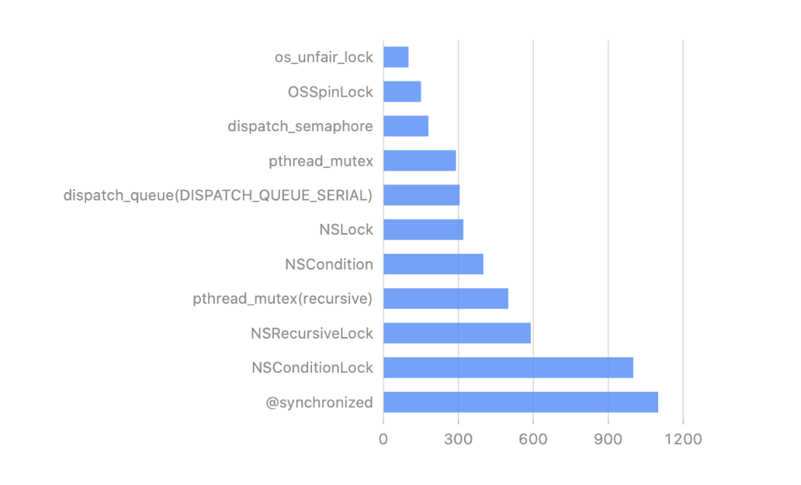

# iOS 面试-多线程

- [线程与进程的区别和联系?](# 线程与进程的区别和联系?)
- [进程间常用通信方式](# 进程间常用通信方式)
- [iOS中实现多线程的几种方案](# iOS中实现多线程的几种方案)
- [线程死锁的四个条件](# 线程死锁的四个条件)
- [串行并行-同步异步](# 串行并行-同步异步)
- [OC 你了解的锁有哪些](# OC 你了解的锁有哪些)

#### 线程与进程的区别和联系?
```
这个问题算是很经典了, 也经常见到
概念:
1、进程是具有一定独立功能的程序、它是系统进行资源分配和调度的一个独立单位，重点在系统调度和单独的单位，
也就是说进程是可以独立运行的一段程序。    
2、线程是进程的一个实体，是 CPU 调度和分派的基本单位，他是比进程更小的能独立运行的基本单位，
线程自己基本上不拥有系统资源。
联系:
1、一个线程只能属于一个进程，而一个进程可以有多个线程，但至少有一个线程（通常说的主线程）。    
2、资源分配给进程，同一进程的所有线程共享该进程的所有资源
3、线程在执行过程中，需要协作同步。不同进程的线程间要利用消息通信的办法实现同步。    
4、处理机分给线程，即真正在处理机上运行的是线程。   
5、线程是指进程内的一个执行单元，也是进程内的可调度实体。
```
#### 进程间常用通信方式
```
1、URL Scheme
2、Keychain
3、UIPasteboard 剪切板功能
4、UIDocumentInteractionController
5、local socket
6、AirDrop
7、UIActivityViewController
8、App Groups
9、Universal Link 通连
```
#### iOS中实现多线程的几种方案
```
NSThread 面向对象的，需要程序员手动创建线程，但不需要手动销毁。子线程间通信很难。

GCD C语言，充分利用了设备的多核，自动管理线程生命周期。比 NSOperation 效率更高。

NSOperation 基于 GCD 封装，更加面向对象，比 GCD 多了一些功能。
进行多线程开发可以控制线程总数及线程依赖关系，可以设置自身的优先级，
还可以判断 Operation 当前的状态(暂停，继续，取消)。

NSOperation 相比 GCD 基于 C 语言开发，效率却更高，建议如果任务之间有依赖关系
或者想要监听任务完成状态的情况下优先选择 NSOperation 否则使用 GCD.
在 GCD 中串行队列中的任务被安排到一个单一线程执行（不是主线程），可以方便地控制执行顺序；
并发队列在多个线程中执行（前提是使用异步方法），顺序控制相对复杂，但是更高效.
在 GCD 中一个操作是多线程执行还是单线程执行取决于当前队列类型和执行方法，
只有队列类型为并行队列并且使用异步方法执行时才能在多个线程中执行
（如果是并行队列使用同步方法调用则会在主线程中执行).
```
#### 线程死锁的四个条件
```
（1）互斥条件：一个资源每次只能被一个线程使用。
（2）占有且等待（请求与保持条件）：即线程已经至少保持了一个资源，但又提出了新的资源请求，
而该资源已经被其他线程占有，此时请求线程被阻塞，但对自己已获得的资源保持不放
（3）不可强行占有（不可剥夺条件）: 即线程所获得的资源在未使用完毕之前，不能被其他线程强行夺走，
只能由获得该资源的线程自己主动释放
（4）循环等待条件: 若干线程之间形成一种头尾相接的循环等待资源关系。
```
#### 串行并行-同步异步
```
队列是来管理线程的，线程里面放着很多的任务，来管理这些任务什么时候在哪些线程里去执行。
队列分为 [串行队列] 和 [并行队列] ：
串行队列：队列中的线程按顺序执行（不会同时执行）
并行队列：队列中的线程会并发执行（同时执行）。
线程里面有非常多的任务（同步，异步）
同步任务：优先级高，在线程中有执行顺序，不会开启新的线程
异步任务：优先级低，在线程中执行没有顺序，看 cpu 闲不闲。在主队列中不会开启新的线程，
其他队列会开启新的线程
```
#### OC 你了解的锁有哪些
```
互斥锁会在访问被加锁数据时，会休眠等待，当数据解锁，互斥锁会被唤醒。
自旋锁遇到被加锁数据时，会进入死循环等待，当数据解锁，自旋锁马上访问。

OSSpinLock：自旋锁，不安全 iOS10 后不建议使用
os_unfair_lock：用于取代不安全的 OSSpinLock ，从 iOS10 开始才支持
pthread_mutex：互斥锁，等待锁的线程会处于休眠状态
@synchronized：关键字加锁，是对 mutex 递归锁的封装，加锁代码少，性能差—- 因为里面会加入异常处理, 
所以耗时。适用线程不多，任务量不大的多线程加锁
NSLock：互斥锁，是对 mutex 普通锁的封装。所有锁（包括 NSLock）的接口实际上都是
通过 NSLocking 协议定义的，它定义了 lock 和 unlock 方法。
你使用这些方法来获取和释放该锁。
NSRecursiveLock：递归锁，有时候加锁代码中存在递归调用，递归开始前加锁，
递归开始调用后重复执行此方法以至于加锁代码照成死锁，使用 NSRecursiveLock，便可解决问题。
NSCondition：条件锁，是对 mutex 和 cond 的封装
NSConditionLock：是对 NSCondition 的进一步封装，可以设置具体的条件值
dispatch_semaphore：信号量实现加锁
```
性能如下：
