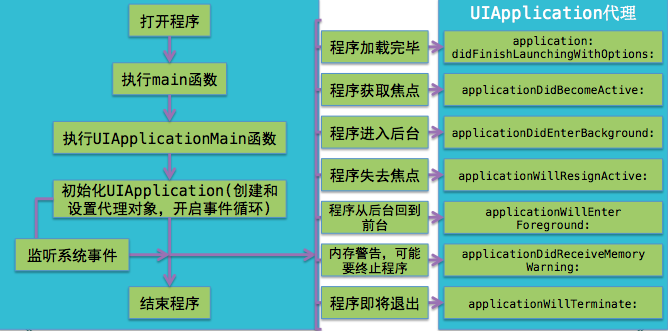

# iOS 面试 - UIKit

- [简述 APP 生命周期](#简述-app-生命周期)
- [APP 启动过程及简单优化](#app-启动过程及简单优化)
- [UIViewController 的生命周期](#uiviewcontroller-的生命周期)
- [loadView 什么作用](#loadview-什么作用)
- [View 中的加载顺序](#view-中的加载顺序)
- [layoutSubviews 何时会被调用](#layoutsubviews-何时会被调用)
- [frame 和 bounds 有什么不同？](#frame-和-bounds-有什么不同？)
- [UIView、CALayer 和 UIWindow 是什么关系](#uiview、calayer-和-uiwindow-是什么关系)
- [CALayer 的 Contents 几个主要的属性](#calayer-的-contents-几个主要的属性)
- [layoutIfNeeded 和 setNeedsLayout 的区别](#layoutifneeded-和-setneedslayout-的区别)
- [CoreGraphics, CoreAnimation 区别](#coregraphics-coreanimation-区别)
- [图像显示原理](#图像显示原理)
- [UI 卡顿掉帧原因](#ui-卡顿掉帧原因)
- [sizeThatFits、sizeToFit](#sizeThatFits、sizeToFit)

#### 简述 APP 生命周期

一张图即可反映 APP 生命周期:


#### APP 启动过程及简单优化
```
1. 解析 Info.plist
加载相关信息，如闪屏
沙箱建立，权限检查
2. Mach-O 加载
如果是胖二进制，寻找合适 CUP 类别的部分
加载所有依赖 Mach-O 文件
定位内部，外部指针引用，如字符串，函数
执行声明函数
加载扩展类
C++ 静态对象加载，调用 Objc 的 +(load)函数
3. 程序执行
main 函数
执行 UIApplicationMain 函数
UIApplicationDelegate 对象开始处理监听事件

如果 APP 启动缓慢，可以想到的因素
main() 函数内有耗时操作;
动态库加载太多;
rootViewControlle 以及 childViewController 的加载，view 和 subViews 的加载耗时;
优化:
移除不需要用到的动态库
移除不需要用到的类
合并功能类似的类和扩展（Category）
压缩图片资源
优化 applicationWillFinishLaunching
优化 rootViewController 加载
```
#### UIViewController 的生命周期
```
0.loadView: 加载视图
1.loadViewIfNeeded(iOS9 后): 重新加载视图包括 viewDidLoad
2.viewDidLoad: 视图控制器中的视图加载完成，viewController 自带的 view 加载完成
3.viewWillAppear: 视图将要出现
4.viewWillLayoutSubviews: 即将布局其 Subviews
5.viewDidLayoutSubviews: 已经布局其 Subviews
6.viewDidAppear: 视图已经出现
7.viewWillDisappear: 视图将要消失
8.viewDidDisappear: 视图已经消失
这个面试点在实际开发中还是比较重要的, 毕竟写个视图都会有自己的生命周期, 从而更好的优化视图加载.
```
![VC 生命周期]](./image/VC生命周期.png)
#### loadView 什么作用
```
loadView 在 View 为 nil 时调用，早于 ViewDidLoad，通常用于代码实现控件，
收到内存警告时会再次调用。
loadView 默认做的事情是: 如果此 Viewcontroller 存在一个对应的 nib 文件，那么就加载这个 nib。
否则，就创建一个 UIView 对象。
如果你用 Interface Builder 来创建界面，那么不应该重载这个方法。

如果你想自己创建 View 对象，那么可以重载这个方法，此时你需要自己给 View 属性赋值。
你自定义的方法不应该调用 super。如果你需要对 View 做一些其他定制操作，在 ViewDidload 中去做

根据上面说明可以知道，有两种情况：

1、如果你用了 nib 文件，重载这个方法就没有太大意义。因为 loadView 的作用就是加载 nib。
如果你重载了这个方法不调用 super，那么 nib 文件就不会被加载。
如果调用了 super，那么 view 已经加载完了，你需要做的其他事情在 viewDidLoad 里面做更合适。

2、如果你没有用 nib，这个方法默认就是创建一个空的 view 对象。如果你想自己控制 view 对象的创建，
例如创建一个特殊尺寸的 view，那么可以重载这个方法，自己创建一个 UIView 对象，然后指定 self.view = myView;
但这种情况也没有必要调用 super，因为反正你也不需要在 super 方法里面创建的 view 对象。
如果调用了 super，那么就是浪费了一些资源而已
```

#### View 中的加载顺序
```
1.initWithCoder（如果没有 storyboard 就会调用 initWithFrame）
2.awakeFromNib: 作为第一个方法的助手，方便处理一些额外的设置。
3.layoutSubviews: 一般设置子控件的 frame。
4.drawRect:UI 控件都是画上去的，在这一步就是把所有的东西画上去。
layoutSubviews 方便数据计算，drawRect 方便视图重绘。
drawRect 在以下情况下会被调用：
1、如果在 UIView 初始化时没有设置 rect 大小，将直接导致 drawRect 不被自动调用。
drawRect 掉用是在 Controller->loadView,Controller->viewDidLoad 两方法之后掉用的.
  所以不用担心在 控制器中, 这些 View 的 drawRect 就开始画了. 
  这样可以在控制器中设置一些值给 View(如果这些 View?draw 的时候需要用到某些变量 值).
2、该方法在调用 sizeToFit 后被调用，所以可以先调用 sizeToFit 计算出 size。
然后系统自动调用 drawRect: 方法。
3、通过设置 contentMode 属性值为 UIViewContentModeRedraw。
那么将在每次设置或更改 frame 的时候自动调用 drawRect:。
4、直接调用 setNeedsDisplay，或者 setNeedsDisplayInRect: 触发 drawRect:，
但是有个前提条件是 rect 不能为 0。
在实际开发中 layoutSubviews 个人用的比较多, 用来重新设置控件大小.
drawRect 一般用来做绘图个人用的不多.
```
#### layoutSubviews 何时会被调用
```
当要调整 subViews 时候，需要重写 layoutSubviews 方法。 
1: 初始化 init 方法时候不会触发。
2: 滚动 UIScrollView 时会触发
3: 旋转 UIScreen 时会触发
4: 当改变 view 的值时候会触发，前提是 frame 前后值发生了变化 
5: 当改变 UIview 的大小时候会触发
```
#### frame 和 bounds 有什么不同？
```
frame 指的是：该 view 在父 view 坐标系统中的位置和大小。（参照点是父亲的坐标系统）
bounds 指的是：该 view 在本身坐标系统中 的位置和大小。（参照点是本身坐标系统）
理解这两个概念在实际开发中还是比较重要的.
```
#### UIView、CALayer 和 UIWindow 是什么关系
```
UIView 是 iOS 系统中界面元素的基础, 所有的界面元素都继承自它, 
UIView 本身完全是由 CoreAnimation 来实现. 真正的绘图部分, 是由一个 CALayer 类来管理.
最大的区别是 UIView 继承自 UIResponder, 能接收并响应事件, 负责显示内容的管理, 
而 CALayer 继承自 NSObject, 不能响应事件, 负责显示内容的绘制. 
UIView 是基于 CALayer 的高层封装。而 CALayer 不支持自动布局.
layer 内部维护着三分 layer tree,分别是 presentLayer Tree(动画树),modeLayer Tree(模型树), Render Tree (渲染树),在做 iOS动画的时候，我们修改动画的属性，在动画的其实是 Layer 的 presentLayer的属性值,而最终展示在界面上的其实是提供 View的modelLayer，需要注意
另外 UIWindow 是一种特殊的 UIView, 通常在一个程序中只会有一个 UIWindow，
但可以手动创建多个 UIWindow，同时加到程序里面。
UIWindow 在程序中主要起到三个作用：
1、作为容器，包含 app 所要显示的所有视图
2、传递触摸消息到程序中 view 和其他对象
3、与 UIViewController 协同工作，方便完成设备方向旋转的支持
```
#### CALayer 的 Contents 几个主要的属性
```
ContentsRect:单位制(0 - 1)，限制显示的范围区域
ContentGravity:类似于 ContentMode，不过不是枚举值，而是字符串
ContentsScale:决定了物理显示屏是 几@X 屏
ContentsCenter:跟拉伸有关的属性
```
#### layoutIfNeeded 和 setNeedsLayout 的区别
```
首先我们布局总会重新触发 layoutSubviews 方法
setNeedsLayout：
标记为需要重新布局，异步调用 layoutIfNeeded 刷新布局，不立即刷新，在下一轮 runloop 结束前刷新，
对于这一轮 runloop 之内的所有布局和 UI 上的更新只会刷新一次，layoutSubviews 一定会被调用。

layoutIfNeeded：
如果有需要刷新的标记，立即调用 layoutSubviews 进行布局（如果没有标记，不会调用 layoutSubviews）。

如果需要立即刷新则调用
[self setNeedsLayout];
[self layoutIfNeeded];

是开发中如果需要在 Masonry 添加约束后如果想获取 frame 可以直接调用
layoutIfNeeded 即可立即获取 frame
```
#### CoreGraphics, CoreAnimation 区别
```
CoreGraphics(核心图形): 它是 iOS 的核心图形库，包含 Quartz2D 绘图 API 接口, 
常用的是 point，size，rect 等这些图形，都定义在这个框架中，
类名以 CG 开头的都属于 CoreGraphics 框架，它提供的都是 C 语言函数接口
CoreAnimation(核心动画)：
1. CoreAnimation 是跨平台的，既可以支持 IOS，也支持 MAC OS。
2. CoreAnimation 执行动画是在后台，不会阻塞主线程。
3. CoreAnimation 作用在 CALayer，不是 UIView。
4. CoreGraphics 和 CoreAnimation 的关系：它们都是跨 iOS 和 Mac OS 使用的，
这点区别于 UIKit，并且 CoreAnimation 中大量使用到 CoreGraphics 中的类，因为实现动画要用到图形库中的东西。
5. CoreGraphics 是底层绘制框架，我们实际会用到的也就是 CG 开头的一些底层绘制函数和变量，这是一个纯 C 语言框架。
```
#### 图像显示原理
```
1.CPU:输出位图
2.GPU:图层渲染，纹理合成
3.把结果放到帧缓冲区(frame buffer)中
4.再由视频控制器根据 vsync 信号在指定时间之前去提取帧缓冲区的屏幕显示内容 
5.显示到屏幕上
CPU 工作
1.Layout: UI 布局，文本计算 
2.Display: 绘制
3.Prepare: 图片解码 
4.Commit:提交位图
GPU 渲染管线(OpenGL) 顶点着色，图元装配，光栅化，片段着色，片段处理
```
#### UI 卡顿掉帧原因
```
iOS 设备的硬件时钟会发出 Vsync(垂直同步信号)，然后 App 的 CPU 会去计算屏幕要显示的内容，
之后将计算好的内容提交到 GPU 去渲染。随后，GPU 将渲染结果提交到帧缓冲区，
等到下一个 VSync 到来时将 缓冲区的帧显示到屏幕上。
也就是说，一帧的显示是由 CPU 和 GPU 共同决定的。 
一般来说，页面滑动流畅是 60fps，也就是 1s 有 60 帧更新，即每隔 16.7ms 就要产生一帧画面，
而如果 CPU 和 GPU 加起来的处理时间超过了 16.7ms，就会造成掉帧甚至卡顿。
```

#### sizeThatFits、sizeToFit
```
一般在使用 UILabel 的时候会用到，使用这两个方法之前，必须要给 label 赋值，否则不会显示内容的。
sizeToFit 会自动调用 sizeThatFits 方法；
sizeToFit 不应该在子类中被重写，应该重写 sizeThatFits；
sizeThatFits 传入的参数是 receiver 当前的 size，返回一个适合的 size；
sizeToFit 可以被手动直接调用；
sizeToFit 和 sizeThatFits 方法都没有递归，对 subviews 也不负责，只负责自己；
```